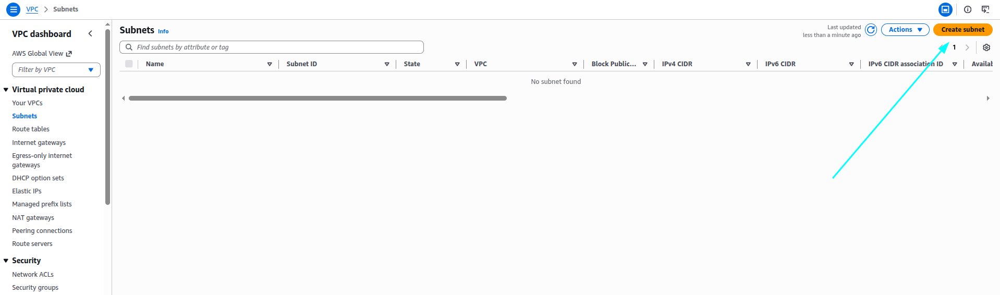
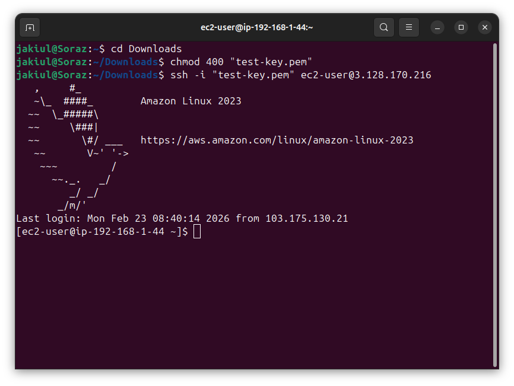
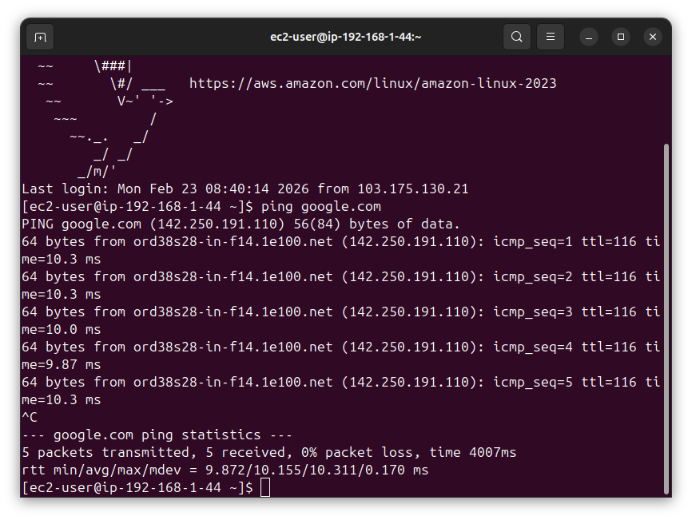

# 🌐 AWS VPC & EC2 Setup Guide – Md Jakiul Rashid Khan (Day 2)

This guide walks through creating a **VPC, Public Subnet, Internet Gateway, Route Table**, and launching an **EC2 instance** on AWS.

---

## 📑 Table of Contents
- [🟢 Step 0: Choose AWS Region](#-step-0-choose-aws-region)
- [🏗️ Step 1: Open VPC Dashboard](#-step-1-open-vpc-dashboard)
  - [1.1 Go to Create VPC](#11-go-to-create-vpc)
  - [1.2 Create VPC](#12-create-vpc)
- [📦 Step 2: Create a Public Subnet](#-step-2-create-a-public-subnet)
  - [2.1 Configure Subnet](#21-configure-subnet)
- [🌐 Step 3: Create an Internet Gateway (IGW)](#-step-3-create-an-internet-gateway-igw)
  - [3.1 Name the IGW](#31-name-the-igw)
  - [3.2 Attach IGW to VPC](#32-attach-igw-to-vpc)
- [🛣️ Step 4: Update Route Table](#-step-4-update-route-table)
  - [4.1 Create Route Table](#41-create-route-table)
  - [4.2 Add Route to IGW](#42-add-route-to-igw)
  - [4.3 Associate Subnet](#43-associate-subnet)
- [🚀 Step 5: Launch an EC2 Instance](#-step-5-launch-an-ec2-instance)
  - [5.1 Configure EC2 Instance](#51-configure-ec2-instance)
- [🔑 Step 6: Connect to EC2 Instance](#-step-6-connect-to-ec2-instance)
  - [6.1 SSH Client Access](#61-ssh-client-access)
- [✅ Conclusion](#-conclusion)

---

## 🟢 Step 0: Choose AWS Region
Log in to **AWS Management Console** and select **Region:**  
**Ohio (us-east-2)** ✅  

> Selecting the correct region is crucial because all resources will be created here.


---

## 🏗️ Step 1: Open VPC Dashboard
- Search for **VPC** in the AWS Console and open **VPC Dashboard**.  


### 1.1 Go to Create VPC
Click **Create VPC** in the dashboard.  


### 1.2 Create VPC
Fill in the following details:  

- **VPC only** ✅  
- **Name:** `Test VPC`  
- **IPv4 CIDR block:** `192.168.0.0/16`  
- **No IPv6 CIDR block**  
- **VPC Encryption:** `Control: None`  
- **Tags:** `Name = test-vpc`  

Click **Create**.  


---

## 📦 Step 2: Create a Public Subnet
Go to **Subnets → Create Subnet**.  



### 2.1 Configure Subnet
Use these settings:  

- **VPC ID:** `test-vpc`  
- **Subnet Name:** `test-public-subnet-01`  
- **Availability Zone:** `us-east-2a`  
- **IPv4 CIDR block:** `192.168.1.0/21`  

Click **Create Subnet** ✅  


---

## 🌐 Step 3: Create an Internet Gateway (IGW)
Go to **Internet Gateways → Create Internet Gateway**.  


### 3.1 Name the IGW
- **Name:** `test-igw`  


### 3.2 Attach IGW to VPC
Attach **test-igw** to **Test VPC** to allow internet access for the public subnet.  

  


---

## 🛣️ Step 4: Update Route Table
Go to **Route Tables** in the VPC dashboard.  


### 4.1 Create Route Table
- **Name:** `test-pub-rt`  
- **VPC:** `test-vpc`  

Click **Create** ✅  


### 4.2 Add Route to IGW
- **Destination:** `0.0.0.0/0`  
- **Target:** `test-igw`  

  


### 4.3 Associate Subnet
- **Subnet selected:** `test-public-subnet-01`  
- Save associations ✅  

  
  


---

## 🚀 Step 5: Launch an EC2 Instance
Go to **EC2 Dashboard → Launch Instances**.  

  


### 5.1 Configure EC2 Instance
Use the following settings:  

- **Name:** `test-app-server`  
- **AMI:** `Amazon Linux`  
- **Instance Type:** `t2.micro`  
- **Key Pair:** `test-key` (RSA `.pem` file)  
- **Network Settings:**  
  - **VPC:** `test-vpc`  
  - **Subnet:** `test-public-subnet-01`  
- **Security Group:** `test-0sg`  
  - **Inbound Rules:**  
    - HTTP, Source: Anywhere  
    - SSH, Source: Anywhere  

Click **Create Instance** ✅  

  
  
  
  
  
  


---

## 🔑 Step 6: Connect to EC2 Instance
Once the EC2 instance **test-app-server** passes **Status Checks**:

### 6.1 SSH Client Access
1. Go to the folder containing `test-key.pem`.  
2. Set permissions:
```bash
chmod 400 test-key.pem
### 🔑 Connect to EC2 Instance

Use the following SSH command to connect to your EC2 instance:

```bash
ssh -i "test-key.pem" ec2-user@<EC2-Public-IP>
### 🌐 Verify Internet Access
```


After successfully connecting to your EC2 instance, run the following command to verify internet connectivity:

```bash
ping google.com
```



