## Step 0: Choose AWS Region
AWS Management Console-এ লগইন করার পর **Region** হিসেবে **Ohio (us-east-2)** নির্বাচন করুন।  
সঠিক Region নির্বাচন করা গুরুত্বপূর্ণ, কারণ পরের সব resource সেই Region-এ তৈরি হবে।

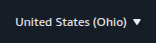

## Step 1: Open VPC Dashboard
আমরা **AWS Console**-এ **VPC** সার্চ করেছি এবং **VPC Dashboard**-এ প্রবেশ করেছি।  

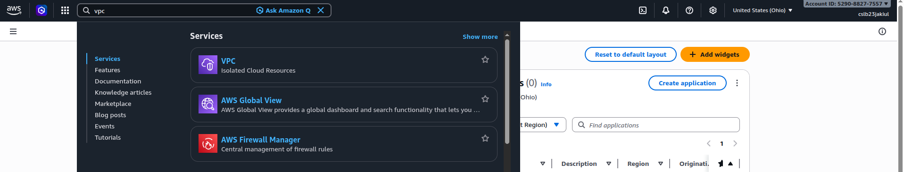

### Step 1.1: Go to Create VPC
আমরা **VPC Dashboard**-এ গিয়ে **Create VPC** বাটনে ক্লিক করেছি।  

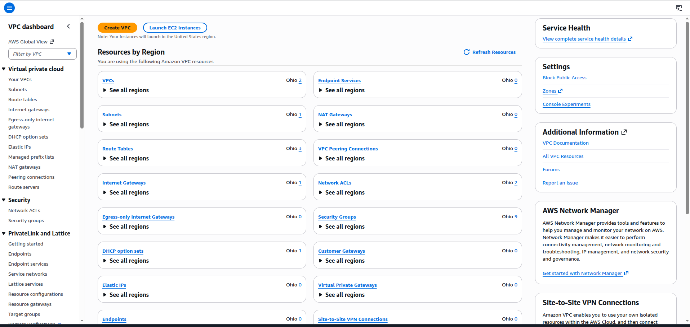

### Step 1.2: Create VPC
আমরা **Create VPC** ফর্মে নিম্নলিখিত সেটিং ব্যবহার করে একটি নতুন VPC তৈরি করেছি:  

- **VPC only** নির্বাচন করেছি  
- **Name:** `Test VPC`  
- **IPv4 CIDR block:** `192.168.0.0/16`  
- **No IPv6 CIDR block**  
- **VPC Encryption:** `Control: None`  
- **Tags:** `Name = test-vpc`  

এরপর **Create** বাটনে ক্লিক করেছি।  


## Step 2: Create a Public Subnet
আমরা **VPC Dashboard**-এ গিয়ে **Subnets → Create Subnet** এ ক্লিক করেছি এবং নতুন Subnet তৈরি করেছি।  
ছবিতে দেখানো হয়েছে Subnet তৈরি হওয়ার পুরো প্রক্রিয়া।  


### Step 2.1: Configure and Create Subnet
নতুন Subnet তৈরি করতে আমরা নিম্নলিখিত সেটিং ব্যবহার করেছি:  

- **VPC ID:** `test-vpc`  
- **Subnet Name:** `test-public-subnet-01`  
- **Availability Zone:** `us-east-2a`  
- **IPv4 CIDR block:** `192.168.1.0/21`  

এরপর **Create Subnet** বাটনে ক্লিক করেছি।  

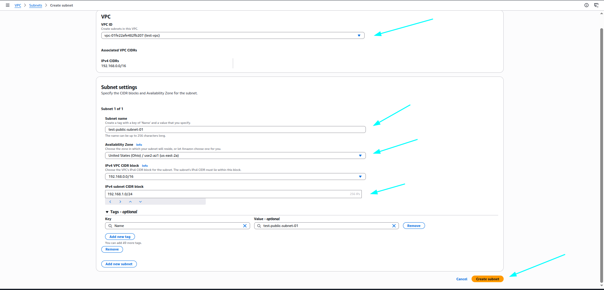

## Step 3: Create an Internet Gateway
আমরা **VPC Dashboard**-এ গিয়ে **Internet Gateways → Create Internet Gateway** এ ক্লিক করেছি।  
ছবিতে দেখানো হয়েছে Internet Gateway তৈরি করার জন্য কোন ফিল্ড পূরণ করতে হবে।  

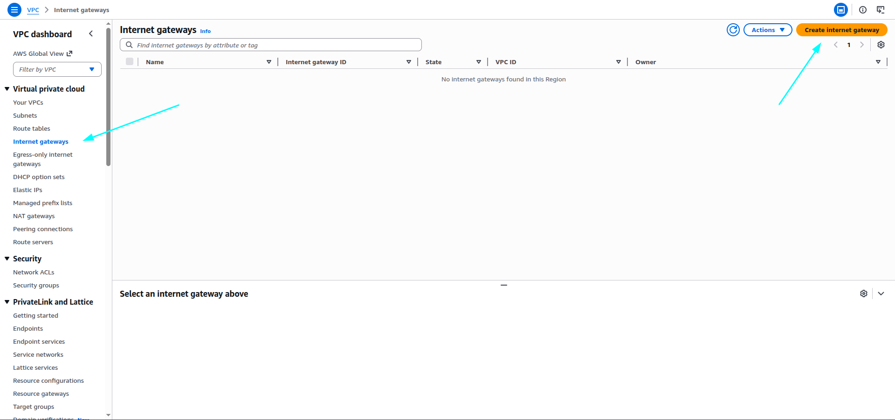

### Step 3.1: Name and Attach Internet Gateway
আমরা Internet Gateway তৈরি করার সময় নিম্নলিখিত সেটিং ব্যবহার করেছি:  

- **Name:** `test-igw`  

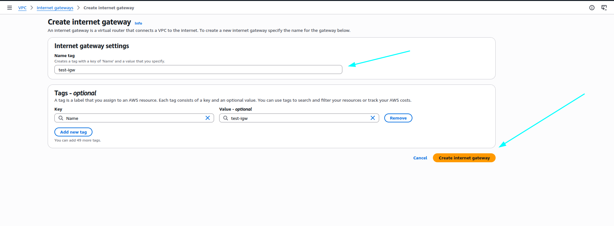

### Step 3.2: Attach Internet Gateway to VPC
আমরা তৈরি করা **test-igw** Internet Gateway-টি আমাদের **Test VPC**-এর সাথে attach করেছি।  
এই ধাপটি Public Subnet-এর জন্য Internet access নিশ্চিত করতে অত্যন্ত গুরুত্বপূর্ণ।  

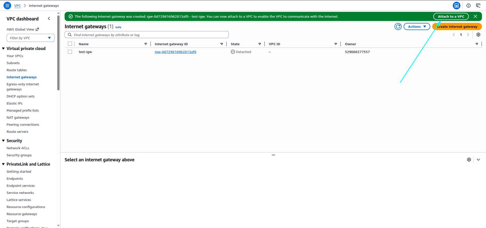
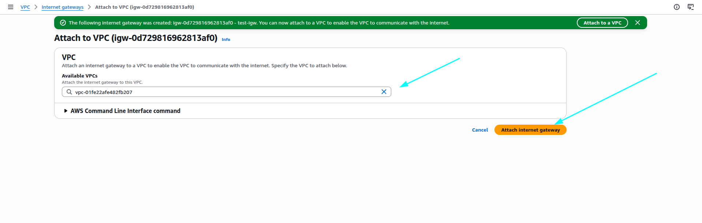


## Step 4: Update Route Table
আমরা **VPC Dashboard**-এ গিয়ে **Route Tables**-এ প্রবেশ করেছি।  
Public Subnet-এর জন্য route update করার জন্য কাজ করেছি।  

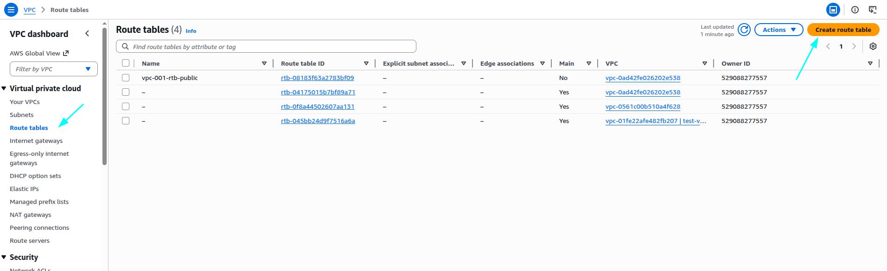

### Step 4.1: Create Route Table
আমরা **Route Tables → Create Route Table** এ গিয়েছি এবং নতুন route table তৈরি করেছি:  

- **Name:** `test-pub-rt`  
- **VPC:** `test-vpc`  

এরপর route table create করেছি।  

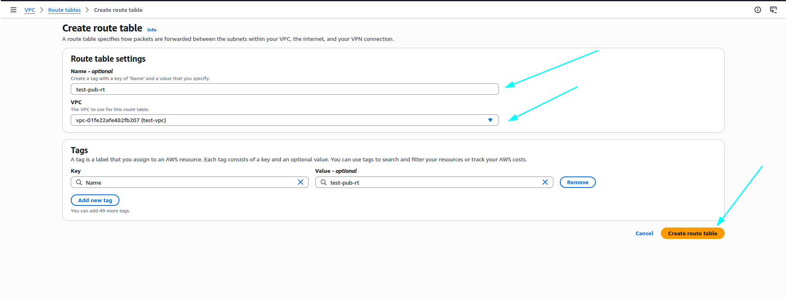

### Step 4.2: Add Route to Internet Gateway
আমরা তৈরি করা **test-pub-rt** route table-এ গিয়ে **Edit routes → Add route** করেছি।  
- **Destination:** `0.0.0.0/0`  
- **Target:** আমাদের তৈরি করা **test-igw** Internet Gateway  

এই ধাপটি নিশ্চিত করে যে Public Subnet থেকে Internet-এ outgoing এবং incoming traffic যাবে।  

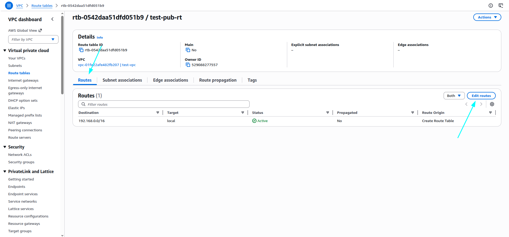
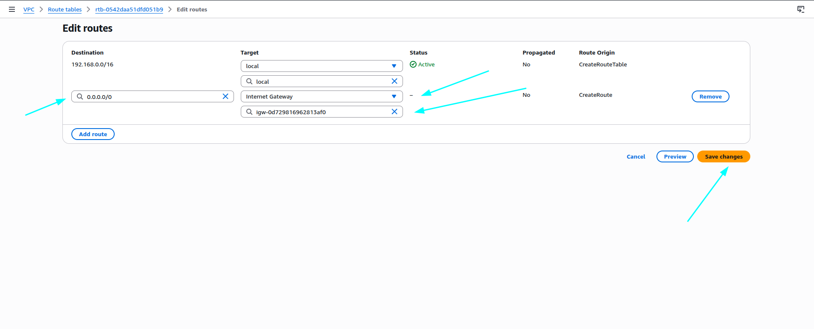

### Step 4.3: Associate Subnet with Route Table
আমরা **test-pub-rt** route table-এ গিয়ে **Subnet Associations → Edit subnet associations** করেছি।  
- **Subnet selected:** `test-public-subnet-01`  

এরপর **Save associations** ক্লিক করেছি।  
এই ধাপ নিশ্চিত করে যে Public Subnet-এর সব traffic এই route table-এর মাধ্যমে Internet Gateway এর সাথে যায়।  

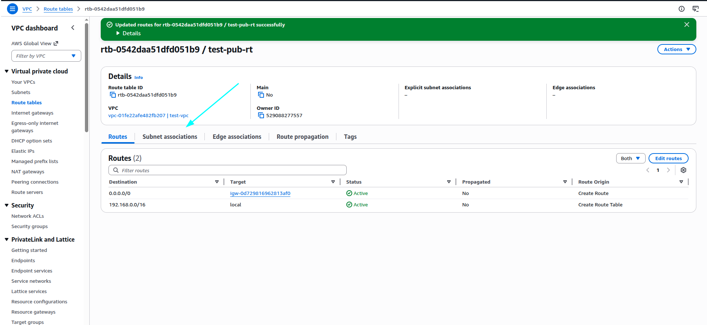
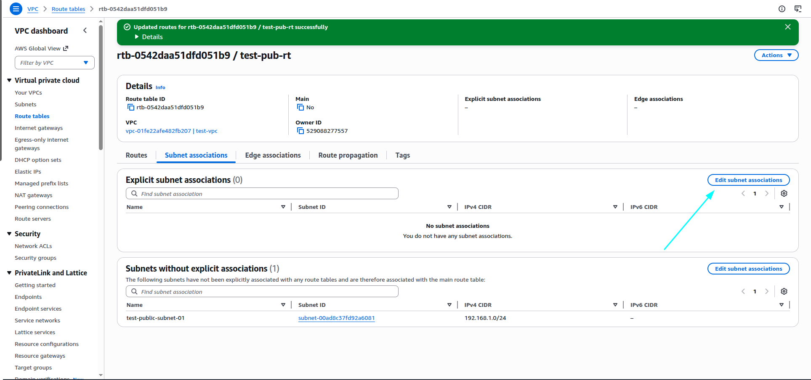
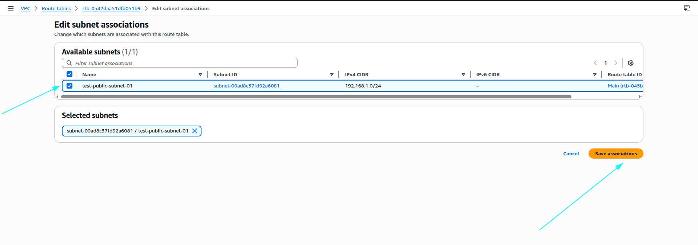

## Step 5: Launch an EC2 Instance
আমরা **AWS Dashboard**-থেকে **EC2**-এ গিয়েছি।  
EC2 Dashboard-এ প্রবেশ করার পর **Launch Instances** এ ক্লিক করেছি, যাতে নতুন instance তৈরি করা যায়।  

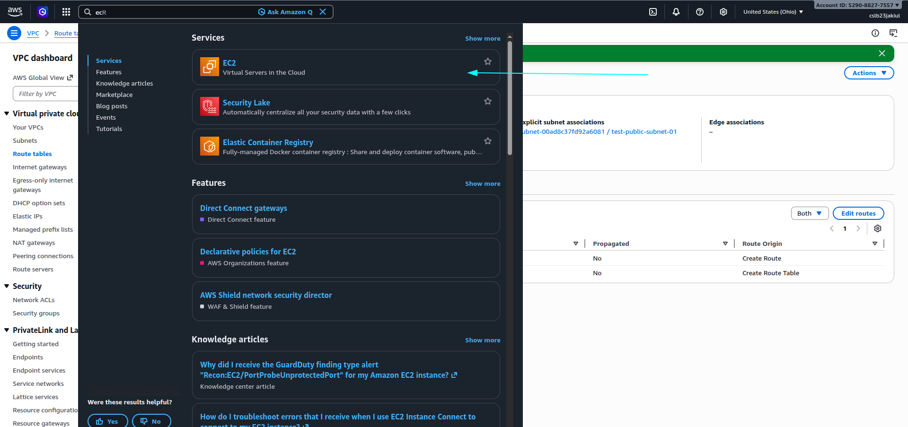
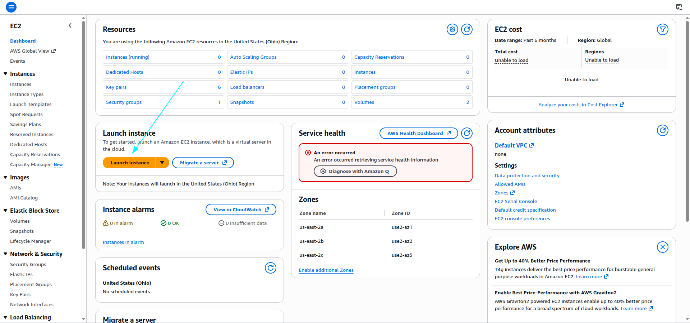

### Step 5.1: Configure EC2 Instance
নতুন EC2 instance তৈরি করার সময় আমরা নিম্নলিখিত সেটিং ব্যবহার করেছি:  

- **Name:** `test-app-server`  
- **Application and OS Image (Amazon Machine Image):** `Amazon Linux`  
- **Instance Type:** `t2.micro`  
- **Key Pair:** `test-key` (RSA `.pem` ফাইল তৈরি করেছি)  
- **Network Settings:**  
  - **VPC:** `test-vpc`  
  - **Subnet:** `test-public-subnet-01`  
- **Security Group:** `test-0sg`  
  - **Inbound Rules:**  
    - HTTP, Source: Anywhere  
    - SSH, Source: Anywhere  

এরপর instance create করেছি।  

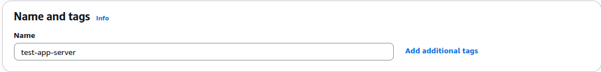

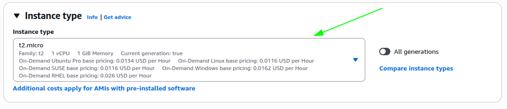
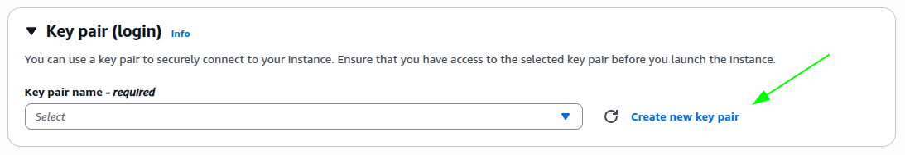
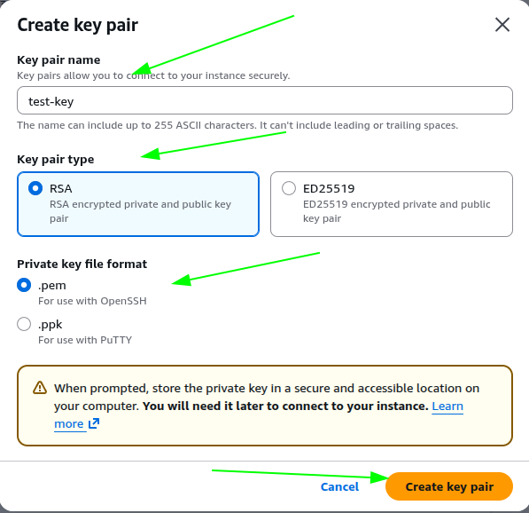
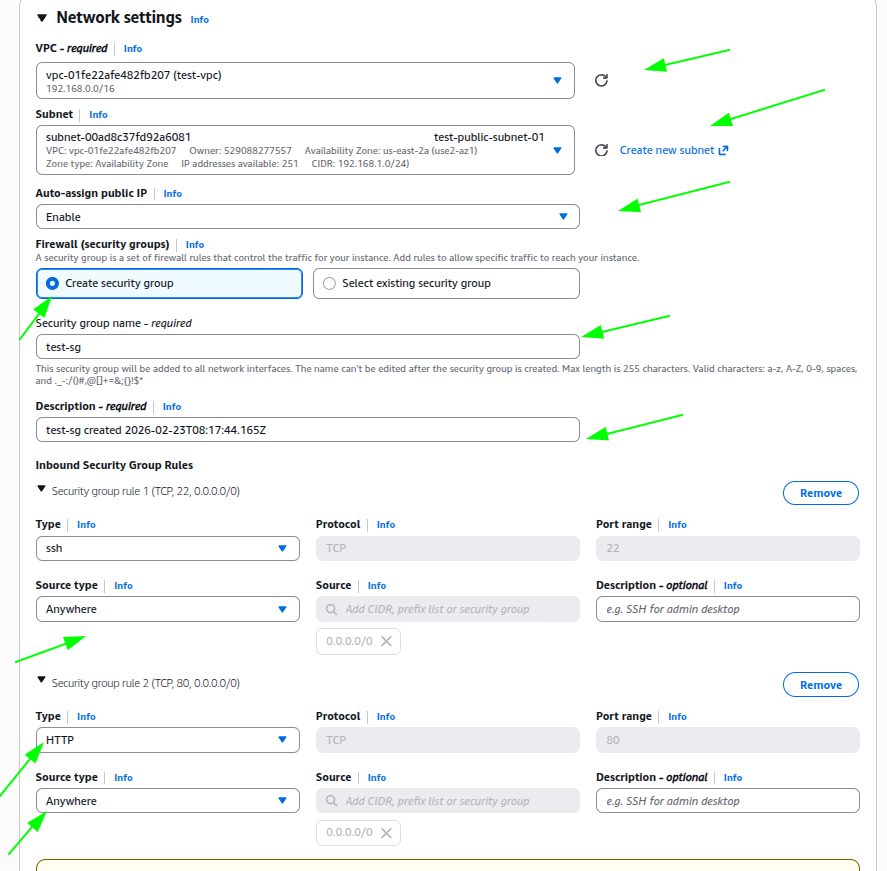
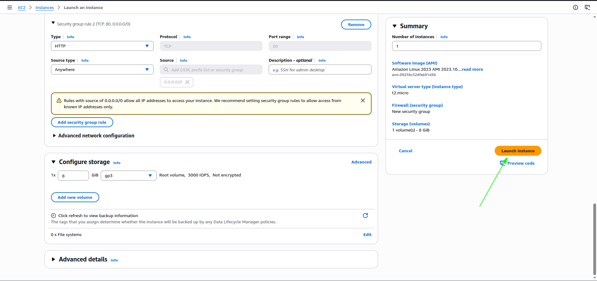

## Step 6: Connect to EC2 Instance
EC2 instance **test-app-server** তৈরি হওয়ার পর **Status Checks** সম্পন্ন হয়েছে (Passed)।  
এরপর instance নির্বাচন করে **Connect** এ গিয়েছি।  

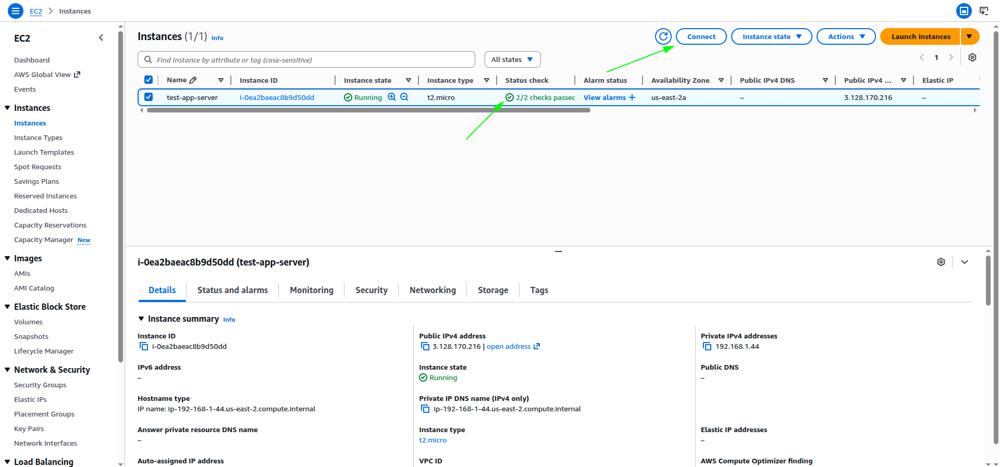

### Step 6.1: SSH Client Access via Command Prompt
EC2 instance **test-app-server**-এ connect করার জন্য আমরা **SSH client** ব্যবহার করেছি।  

**Steps:**  
1. **Key Pair Location:** Command Prompt-এ সেই folder-এ গিয়েছি যেখানে `test-key.pem` file আছে (উদাহরণ: `Downloads`)  
2. **Set Permissions:**  
```bash
chmod 400 test-key.pem
Connect to EC2 Instance:
3.**Connect to EC2 Instance:**
```bash
ssh -i "test-key.pem" ec2-user@3.128.170.216
4.**Verify Internet Access:**
```bash
ping google.com
Response পেয়ে নিশ্চিত করেছি যে Internet connection ঠিক আছে।


