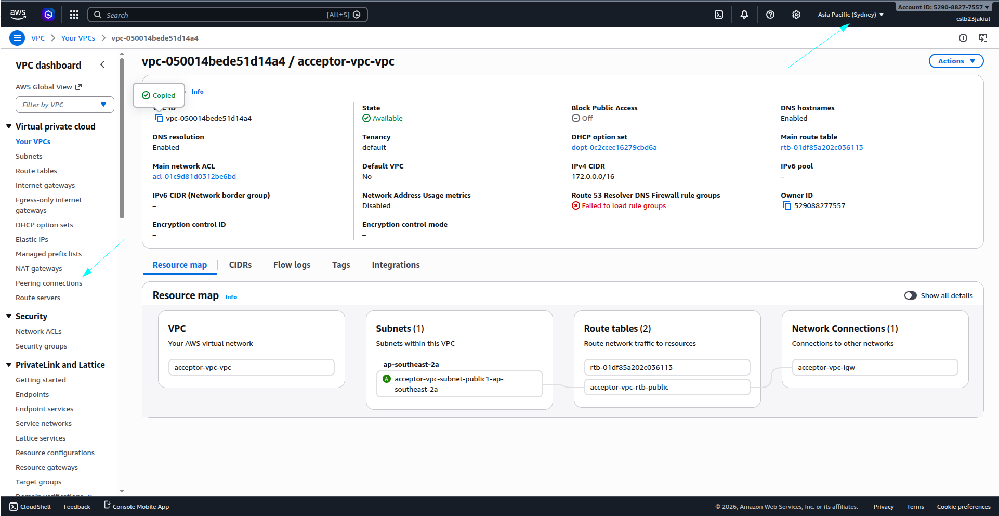
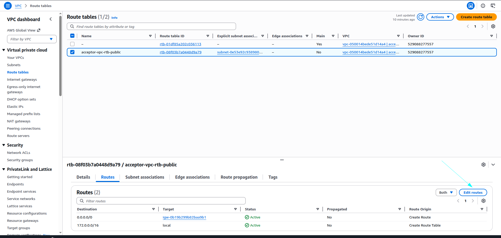
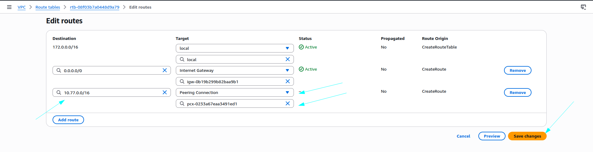
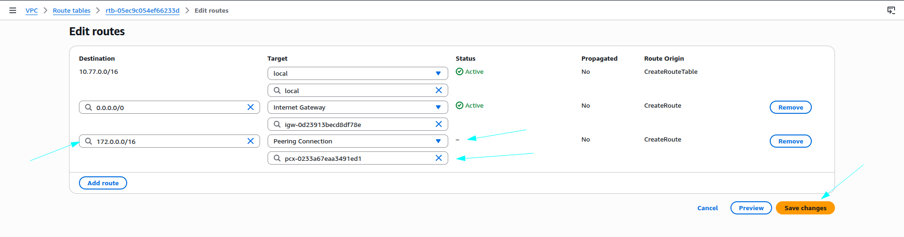
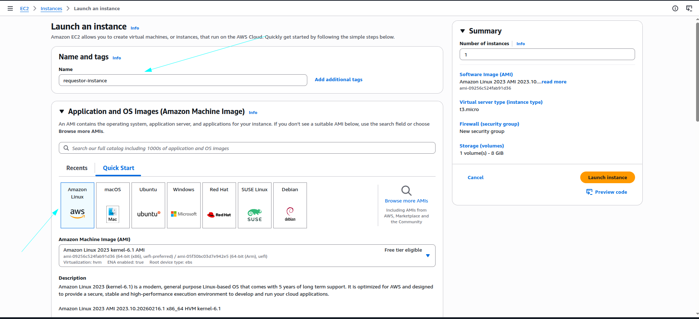
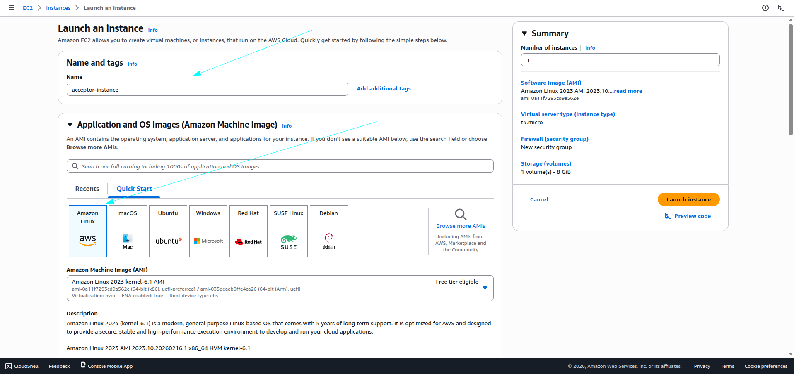
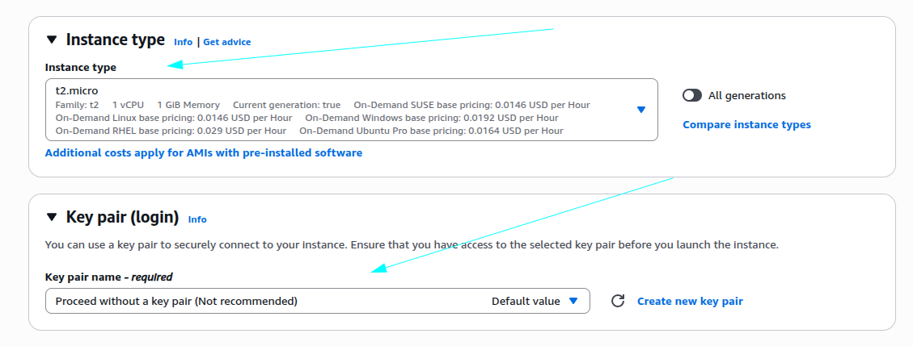
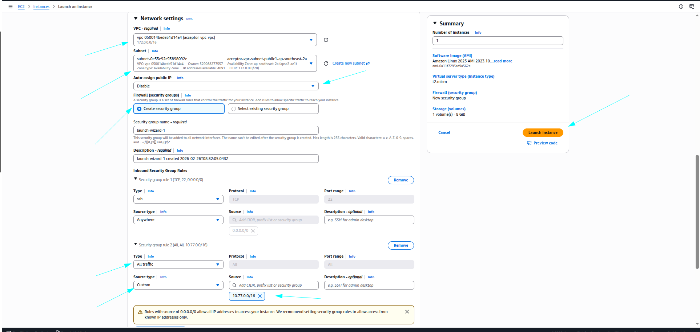
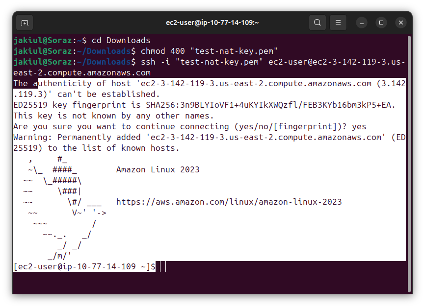

# 🌍 AWS VPC Peering (Cross-Region) Lab – Ohio ↔ Sydney

## 📑 Table of Contents

1. 🏁 [Step 0: Create Regions](#-step-0-create-regions)  
2. 🏗️ [Step 1: Create VPCs](#-step-1-create-vpcs)  
   - 🌐 [1.1 Ohio Region – Requestor VPC](#11-ohio-region--requestor-vpc)  
   - 🌏 [1.2 Sydney Region – Acceptor VPC](#12-sydney-region--acceptor-vpc)  
3. 🔗 [Step 2: Create VPC Peering Connection](#-step-2-create-vpc-peering-connection-🔗)  
   - 🖥️ [Ohio Region – Requestor](#ohio-region--requestor)  
   - 🛡️ [2.1 Sydney Region – Acceptor](#21-sydney-region--acceptor)  
4. 🛣️ [Step 3: Update Route Tables](#-step-3-update-route-tables-🛣️)  
   - 🗺️ [3.1 Sydney Region – Acceptor VPC](#31-sydney-region--acceptor-vpc)  
   - 🗺️ [3.2 Ohio Region – Requestor VPC](#32-ohio-region--requestor-vpc)  
5. 💻 [Step 4: Launch EC2 Instances](#-step-4-launch-ec2-instances-💻)  
   - ⚡ [4.1 Ohio Region – Requestor Instance](#41-ohio-region--requestor-instance)  
   - ⚡ [4.2 Sydney Region – Acceptor Instance](#42-sydney-region--acceptor-instance)  
6. 🔍 [Step 5: Test Connectivity Between EC2 Instances](#-step-5-test-connectivity-between-ec2-instances-🔍)  
   - 🖱️ [5.1 SSH into Requestor Instance (Ohio)](#51-ssh-into-requestor-instance-ohio)  
   - 📡 [5.2 Ping Acceptor Instance (Sydney)](#52-ping-acceptor-instance-sydney)

---

## 🛠 Step 0: Create Regions

1. Created two regions in the same AWS account:  
   - **United States (Ohio)** – Requestor VPC 🌐  
   - **Asia Pacific (Sydney)** – Acceptor VPC 🌏  

2. Created VPCs, subnets, and EC2 instances in both regions.  

3. **Screenshots:**

- Ohio VPC:  
  

- Sydney VPC:  


---

## 🛠 Step 1: Create VPCs

### 1.1 Ohio Region – Requestor VPC

**Configuration:**

- VPC Name: `requestor-vpc`  
- IPv4 CIDR Block: `10.77.0.0/16`  
- IPv6 CIDR Block: None  
- Tenancy: Default  
- Availability Zones: 1  
- Public Subnets: 1  
- Private Subnets: 0  
- NAT Gateways: None  
- VPC Endpoints: None  

**Workflow Automatically Created:** VPC → Subnet → Internet Gateway → Route Table  

**Screenshots:**  

  
  
  


---

### 1.2 Sydney Region – Acceptor VPC

**Configuration:**

- VPC Name: `acceptor-vpc`  
- IPv4 CIDR Block: `172.0.0.0/16`  
- IPv6 CIDR Block: None  
- Tenancy: Default  
- Availability Zones: 1  
- Public Subnets: 1  
- Private Subnets: 0  
- NAT Gateways: None  
- VPC Endpoints: None  

**Workflow Automatically Created:** VPC → Subnet → Internet Gateway → Route Table  

**Screenshots:**  

  
  
  


---

## 🛠 Step 2: Create VPC Peering Connection 🔗

### Ohio Region – Requestor

1. Navigate to **VPC Dashboard → Peering Connections → Create Peering Connection**  
2. Configure peering:

- Peering Connection Name: `us-ohio-to-ap-sydney`  
- Requester VPC: `requestor-vpc`  
- Account: My Account  
- Region: Another Region (Sydney)  
- Acceptor VPC: `acceptor-vpc` (Sydney VPC ID)  

3. Click **Create Peering Connection**

**Screenshots:**  

  
  


---

### 2.1 Sydney Region – Acceptor

1. Switch to **Sydney Region**  
2. Go to **VPC Dashboard → Peering Connections**  
3. Status: **Pending Acceptance**  
4. Select the request → **Actions → Accept Request**  

**Screenshots:**  

  
  


---

## 🛠 Step 3: Update Route Tables 🛣️

### 3.1 Sydney Region – Acceptor VPC

1. Go to **Route Tables → acceptor-vpc-rtb-public → Routes → Edit Routes**  
2. Add route:  

- Destination: `10.77.0.0/16` (Ohio VPC CIDR)  
- Target: Peering Connection (`pcx-xxxx`)  
- Save Changes ✅  

**Screenshots:**  

  
  


---

### 3.2 Ohio Region – Requestor VPC

1. Go to **Route Tables → requestor-vpc-rtb-public → Routes → Edit Routes**  
2. Add route:  

- Destination: `172.0.0.0/16` (Sydney VPC CIDR)  
- Target: Peering Connection (`pcx-xxxx`)  
- Save Changes ✅  

**Screenshots:**  

  
  


---

## 🛠 Step 4: Launch EC2 Instances 💻

### 4.1 Ohio Region – Requestor Instance

**Configuration:**

- Instance Name: `requestor-instances`  
- OS Image: Amazon Linux  
- Instance Type: t2.micro  
- Key Pair: `test-nat-key`  
- Network: `requestor-vpc` → Subnet → Auto-assign Public IP: Enabled  
- Security Group: SSH (22) → Anywhere `0.0.0.0/0`  

**Screenshots:**  

  
  
  


---

### 4.2 Sydney Region – Acceptor Instance

**Configuration:**

- Instance Name: `acceptor-instances`  
- OS Image: Amazon Linux  
- Instance Type: t2.micro  
- Key Pair: Proceed without a key pair  
- Network: `acceptor-vpc` → Subnet → Auto-assign Public IP: Disabled  
- Security Group: All Traffic → Source: `10.77.0.0/16`  

**Screenshots:**  

  
  
  


---

## 🛠 Step 5: Test Connectivity Between EC2 Instances 🔍

### 5.1 SSH into Requestor Instance (Ohio)

1. Open **Terminal / Command Prompt**  
2. Navigate to key location:

```bash
cd Downloads

chmod 400 test-nat-key.pem

ssh -i "test-nat-key.pem" ec2-user@<Requestor-Public-IP>

ping <Requestor-Private-IP>

ping <Acceptor-Private-IP>
```
**Screenshots:**




