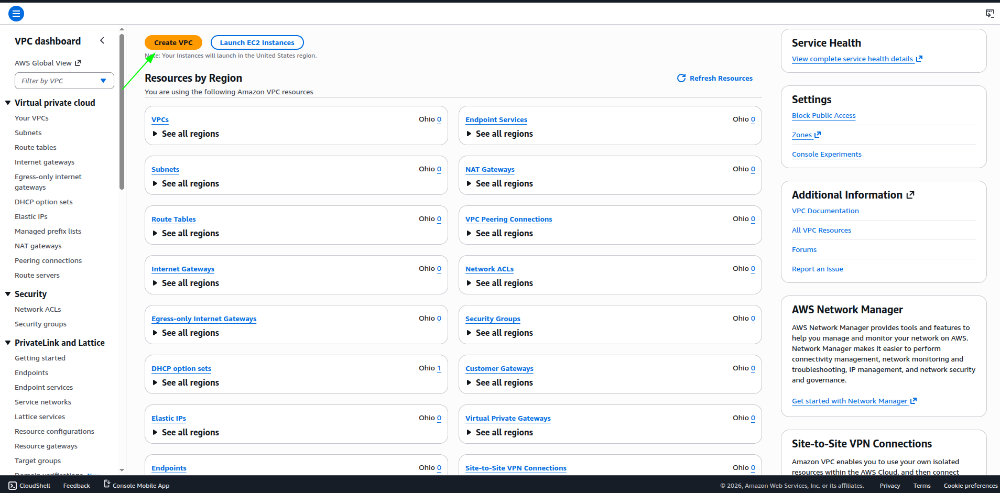
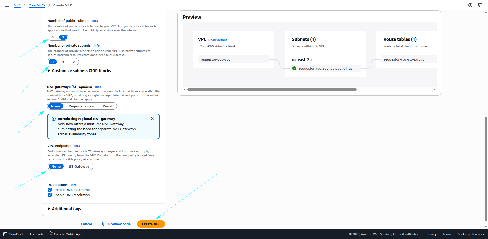
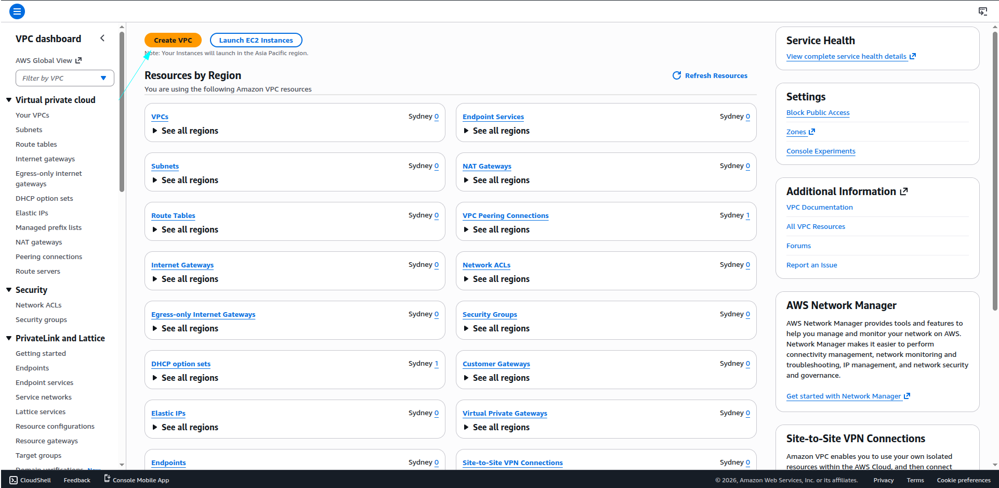
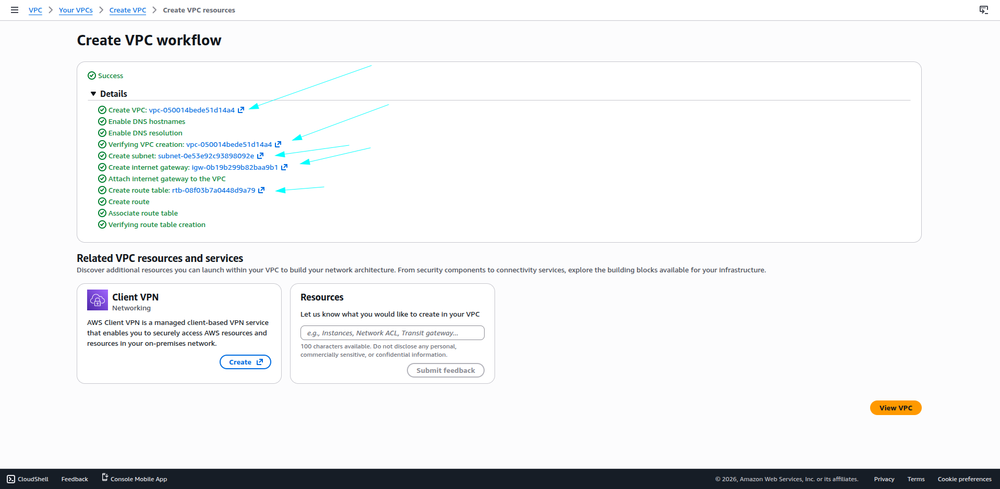
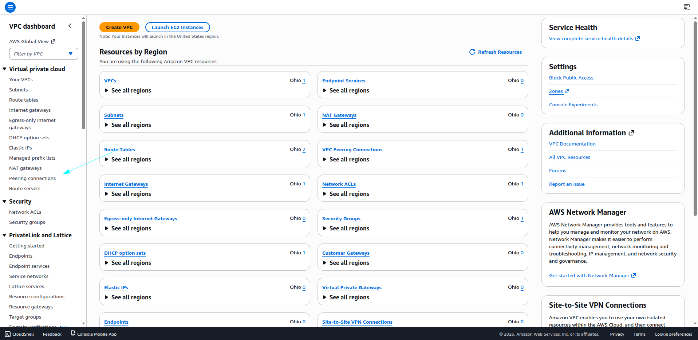

# 🌍 AWS VPC Peering (Cross-Region) Lab – Ohio ↔ Sydney

## 🛠 Step 0: Create Regions

1. Created two regions in the same AWS account:
   - **United States (Ohio)** – Requestor VPC  
   - **Asia Pacific (Sydney)** – Acceptor VPC  

2. Created VPCs, subnets, and EC2 instances in both regions.

3. Screenshots of the VPCs:

- Ohio VPC:  
  

- Sydney VPC:  

# 🌍 AWS VPC Peering (Cross-Region) Lab – Ohio ↔ Sydney

## 🛠 Step 1: Create VPCs

### 1.1 Ohio Region – Requestor VPC

**Configuration:**

- **VPC Name:** `requestor-vpc`  
- **IPv4 CIDR Block:** `10.77.0.0/16`  
- **IPv6 CIDR Block:** None  
- **Tenancy:** Default  
- **Availability Zones:** 1  
- **Public Subnets:** 1  
- **Private Subnets:** 0  
- **NAT Gateways:** None  
- **VPC Endpoints:** None  

**Workflow Automatically Created:**

- VPC  
- Subnet  
- Internet Gateway  
- Route Table  

**Screenshots:**

 
 

 
 

 

 
 

---

### 1.2 Sydney Region – Acceptor VPC

**Configuration:**

- **VPC Name:** `acceptor-vpc`  
- **IPv4 CIDR Block:** `172.0.0.0/16`  
- **IPv6 CIDR Block:** None  
- **Tenancy:** Default  
- **Availability Zones:** 1  
- **Public Subnets:** 1  
- **Private Subnets:** 0  
- **NAT Gateways:** None  
- **VPC Endpoints:** None  

**Workflow Automatically Created:**

- VPC  
- Subnet  
- Internet Gateway  
- Route Table  

**Screenshots:**

  
 
  
  
  

## 🛠 Step 2: Create VPC Peering Connection

### Ohio Region – Requestor

1. Go to **VPC Dashboard** in Ohio region.  
2. Click **Peering Connections → Create Peering Connection**  
3. Configure peering:

- **Peering Connection Name:** `us-ohio-to-ap-sydney`  
- **Requester VPC:** `requestor-vpc`  
- **Account:** My Account  
- **Region:** Another Region (Sydney)  
- **Acceptor VPC:** `acceptor-vpc` (Sydney region VPC ID)

4. Click **Create Peering Connection**

**Screenshots:**

  

  

 

---

### 2.1 Sydney Region – Acceptor

1. Switch to **Sydney Region**  
2. Go to **VPC Dashboard → Peering Connections**  
3. Status shows **Pending Acceptance**  
4. Select the peering request → **Actions → Accept Request**  

**Screenshots:**

[Pending Acceptance](images/14.png)  

 
 

