# AWS EC2 Launch Template Setup

## Step 1: Navigate to Launch Templates

At first, log in to AWS Management Console and go to the EC2 Dashboard.  
From the left sidebar, click on **Launch Templates**.

### Screenshot

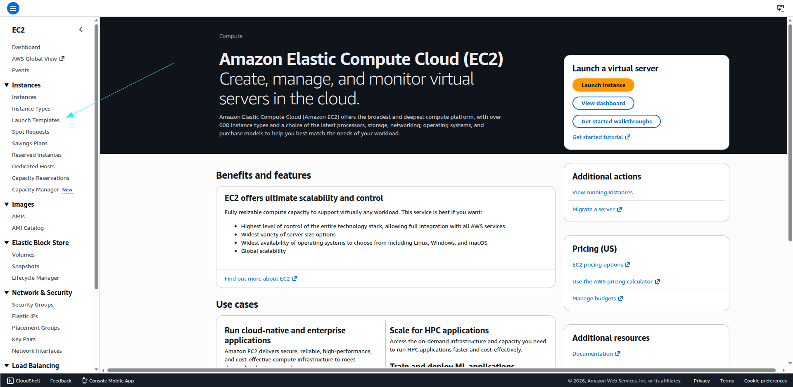

## Step 2: Create Launch Template

From the **Launch Templates** section, click on the **Create launch template** button.

This will open the configuration page where we can define instance settings.

### Screenshot

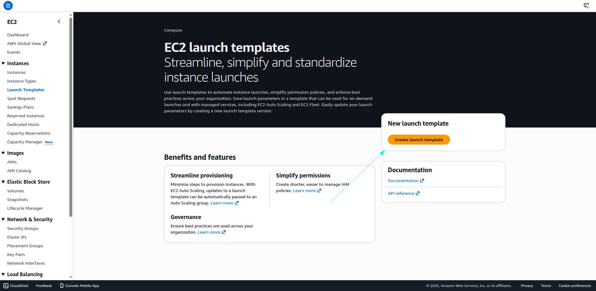

## Step 3: Configure Launch Template

In this step, we configure the Launch Template settings based on requirements.

### Basic Configuration
- **Template Name**: Provided a custom name
- **Description**: Added a short description for the template

### Auto Scaling
- Not configured, because this is a demo setup  
- Can be added later if needed

### Template Options
- Template tags and source template options are available  
- Skipped for simplicity in this demo

### Instance Configuration
- **Instance Type**: Selected based on requirement (can be changed anytime)
- **Key Pair**: Added a key pair (optional, user can choose to add or skip)

### Network Settings
- Default settings used  
- Can be customized depending on use case

### Storage
- Kept default storage configuration  
- Can increase or decrease as needed

### Resource Tags
- Not added (optional)

### Advanced Settings
- Left as default  
- Can be customized for advanced use cases

---

### Screenshots

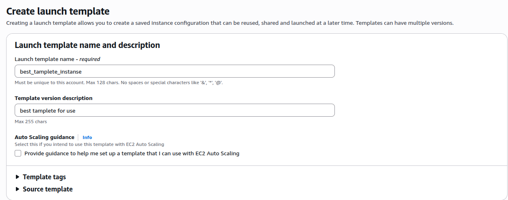  
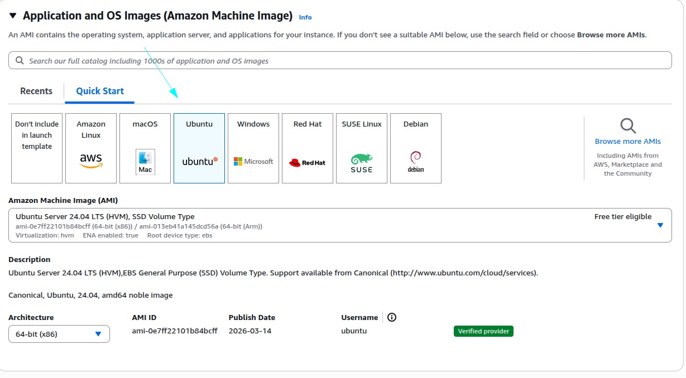  
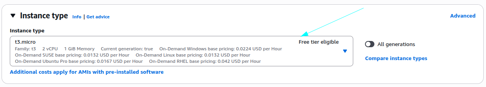  
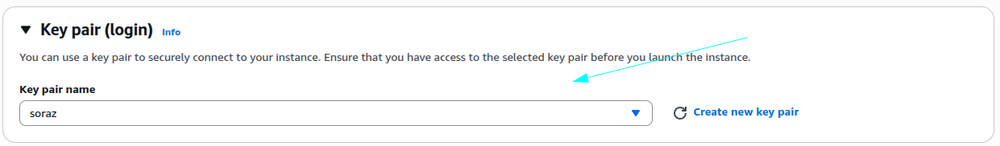  
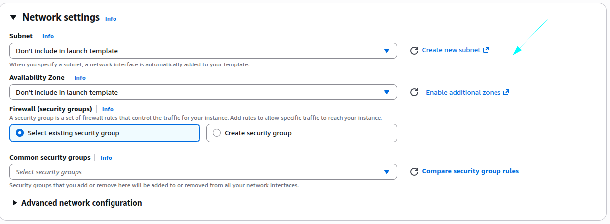  
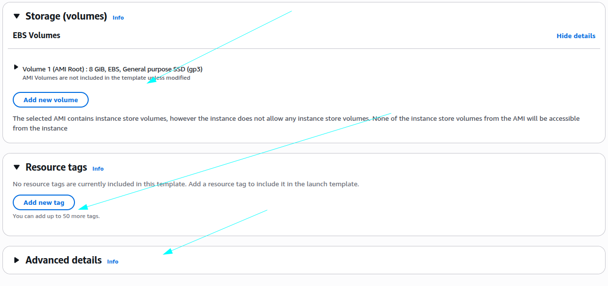  

## Step 4: Create Launch Template

After configuring all the required settings, click on the **Create launch template** button.

Once the template is successfully created, AWS will show a confirmation message.

### Result
- Launch Template created successfully
- Now it can be used to launch EC2 instances or with Auto Scaling

---

### Screenshots

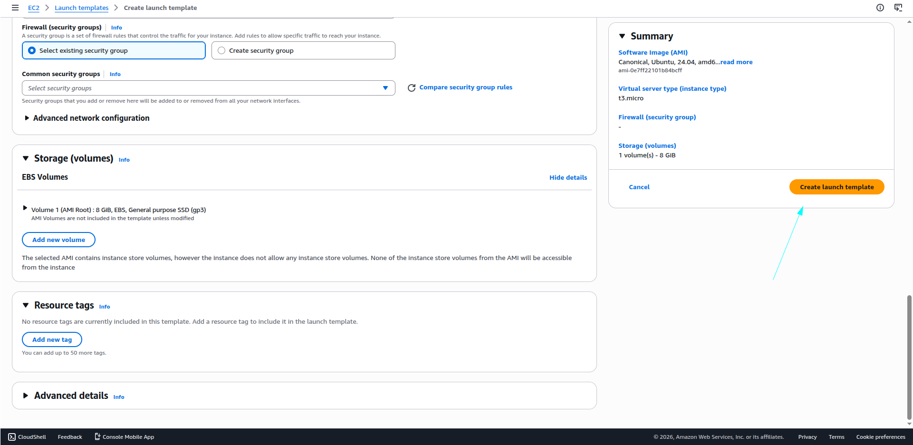  
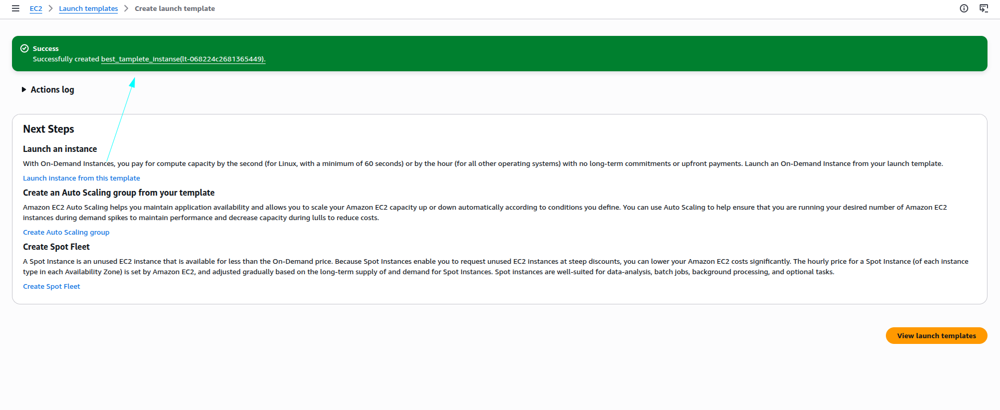

## Step 5: Use Launch Template to Launch EC2 Instance

The created Launch Template can be reused anytime in the future.

### How to Use:
1. Go to **Launch Templates** section from EC2 Dashboard  
2. Select your created template  
3. Click on **Actions**  
4. Choose **Launch instance from template**

### Customization
- You can modify configurations before launching the instance  
- যেমন:
  - Instance type change করা
  - Network settings update করা
  - Storage adjust করা
  - Key pair change করা

This makes Launch Templates very flexible and reusable.

---

### Screenshot

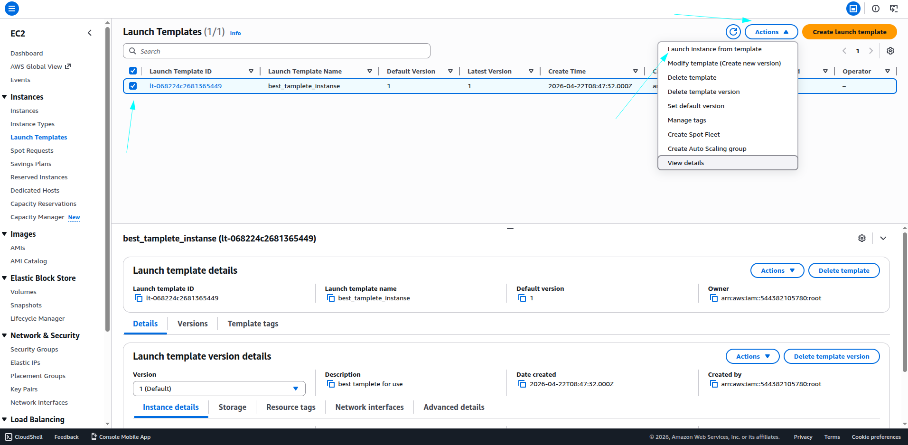
