# ☁️ AWS VPC Setup for Load Balancer Demo

## 🎯 Project Goal
This project demonstrates how to build a **Highly Available Load Balanced Web Architecture** using AWS services:

- VPC
- EC2 Instances
- Nginx Web Server
- Target Group
- Application Load Balancer (ALB)

---

## 🚀 Step 1: VPC Creation

I went to the AWS Console and opened the VPC Dashboard. Then I created a new VPC using the **Create VPC → VPC and more** option.

## ⚙️ VPC Configuration

- 🏷️ Name: `load-balancer-demo`
- 🌐 IPv4 CIDR: `10.0.0.0/16`
- 🧾 Tenancy: Default
- 🌍 Availability Zones: 2
- 📡 Public Subnets: 2
- 🔒 Private Subnets: 0
- 🚫 NAT Gateway: None
- 🚫 VPC Endpoint: None

## ✅ Result

The VPC was successfully created.

- ✔️ 2 Public Subnets in 2 Availability Zones
- 🌐 Internet Gateway (IGW) attached
- 🛣️ Route Table (RT) created and configured

## 📸 Screenshots

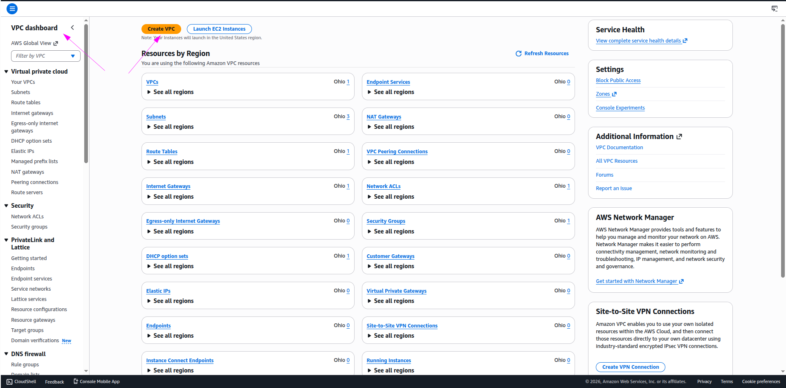

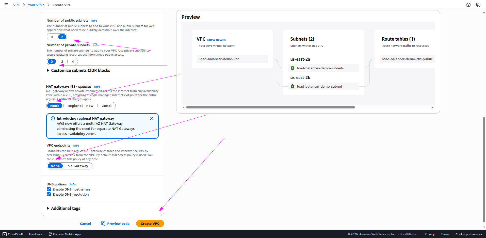

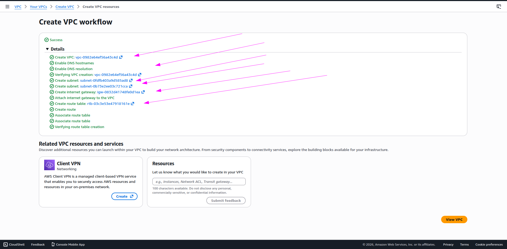

---

# 🖥️ AWS EC2 Instance Setup for Load Balancer

## 🚀 Step 2: EC2 Instance Creation

I went to the AWS EC2 Dashboard and launched two EC2 instances using the **Launch Instance** option.

---

## 🖥️ Instance 1: load-balancer-server-a

### ⚙️ Configuration:
- 🏷️ Name: `load-balancer-server-a`
- 🐧 OS Image: Amazon Linux
- 💻 Instance Type: `t3.micro`
- 🔑 Key Pair: `load-balancer-demo`

### 🌐 Network Settings:
- ☁️ VPC: `load-balancer-demo`
- 🌍 Availability Zone: `us-east-2a`
- 📡 Subnet: Public Subnet (AZ-a)
- 🌐 Auto-assign Public IP: Enabled

### 🔐 Security Group:
- 🔑 SSH (22) → Source: `0.0.0.0/0`
- 🌐 HTTP (80) → Source: `0.0.0.0/0`

---

## 🖥️ Instance 2: load-balancer-server-b

### ⚙️ Configuration:
- 🏷️ Name: `load-balancer-server-b`
- 🐧 OS Image: Amazon Linux
- 💻 Instance Type: `t3.micro`
- 🔑 Key Pair: `load-balancer-demo`

### 🌐 Network Settings:
- ☁️ VPC: `load-balancer-demo`
- 🌍 Availability Zone: `us-east-2b`
- 📡 Subnet: Public Subnet (AZ-b)
- 🌐 Auto-assign Public IP: Enabled

### 🔐 Security Group:
- 🔑 SSH (22) → Source: `0.0.0.0/0`
- 🌐 HTTP (80) → Source: `0.0.0.0/0`

---

## 📸 Screenshots

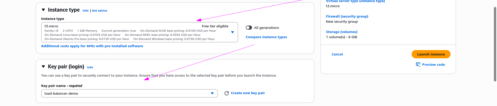

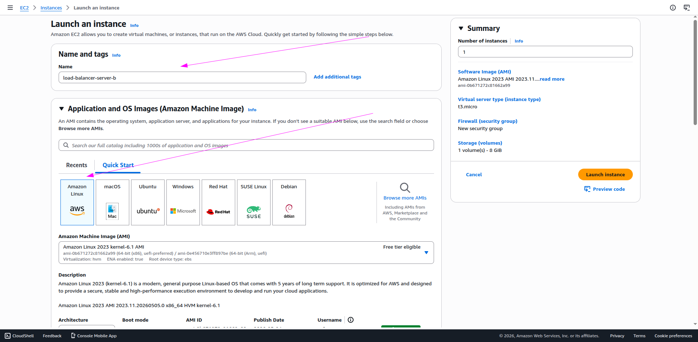

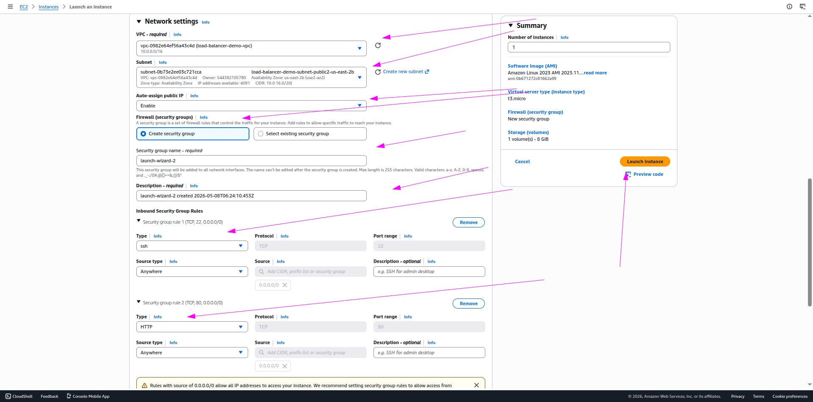

---

# 🖥️ EC2 Access & Nginx Setup (Load Balancer Backend Servers)

## 🚀 Step 3: SSH Access to EC2 Instances

I accessed the EC2 instances from my local terminal. I navigated to the Downloads folder where the `.pem` key file was stored. Then I secured the key file permissions and connected to both EC2 instances using SSH.

---

## 🔐 Server Naming Setup

### 🖥️ Server A
- After logging into the first EC2 instance, I changed the hostname to `serverA`
- I exited and reconnected via SSH to verify the hostname in the terminal
- This helped clearly identify which server I was working on

### 🖥️ Server B
- I repeated the same process on the second EC2 instance
- The hostname was changed to `serverB`
- Reconnected via SSH to confirm the change

---

## 👤 Root Access & System Update

- I switched to root user on both servers
- I updated the system packages to the latest version

---

## 🌐 Nginx Installation & Setup

### 🖥️ Server A
- Installed Nginx
- Started Nginx service
- Enabled Nginx service to start automatically on reboot

### 🖥️ Server B
- Installed Nginx
- Started Nginx service
- Enabled Nginx service to start automatically on reboot

---

## 📸 Screenshots

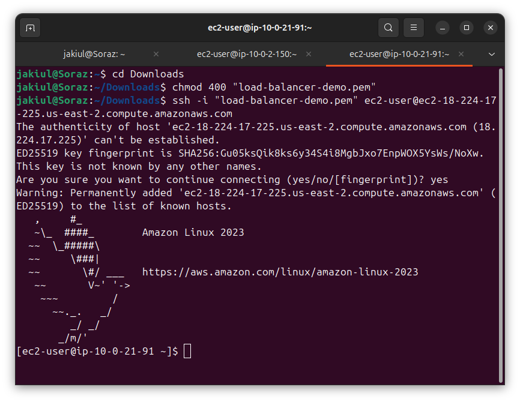

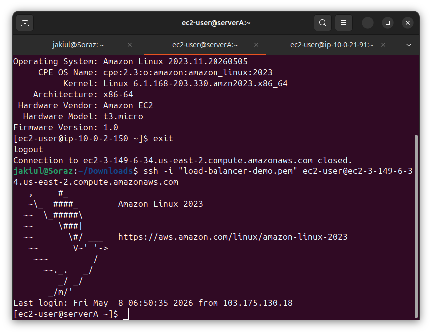

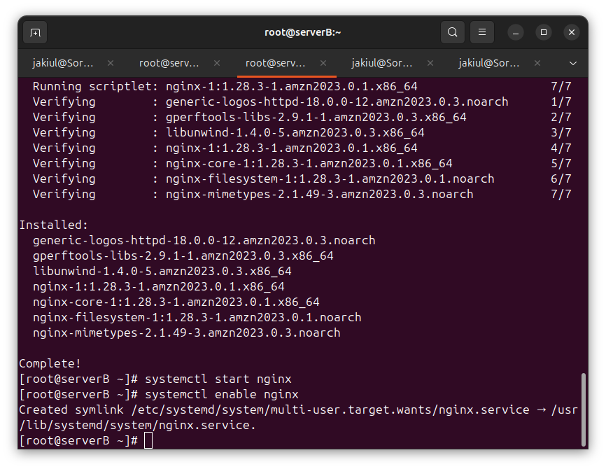

---

## 📌 Result

- ✔ Successfully accessed both EC2 instances via SSH  
- ✔ Hostnames configured as serverA and serverB  
- ✔ System packages updated  
- ✔ Nginx installed and running on both servers  
- ✔ Both servers are ready to serve web traffic behind a load balancer

  # 🌐 Nginx Verification on EC2 Instances

## 🚀 Step 4: Browser Test (Public IP Access)

I accessed both EC2 instances using their public IP addresses from the browser to verify Nginx.

At first, the default Nginx welcome page was displayed on both servers.

Then I modified the default HTML page on both instances.

- On the first server, I changed the message to **"Welcome to Server A"**
- On the second server, I changed the message to **"This is Server B"**

This helped clearly identify both servers through the browser.

---

## 📸 Screenshots

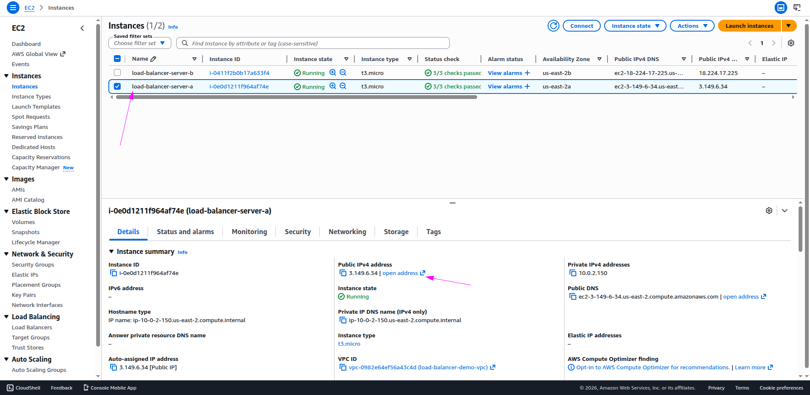

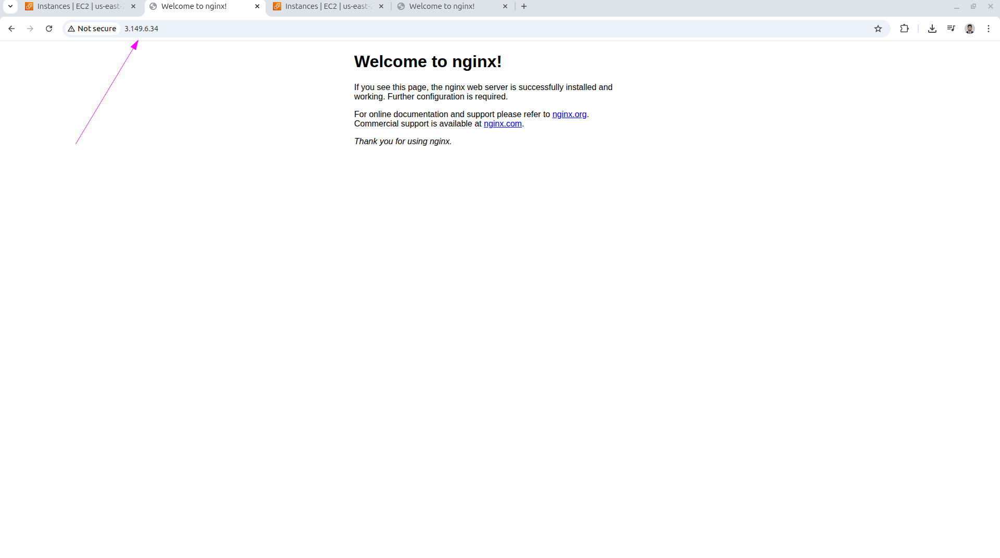

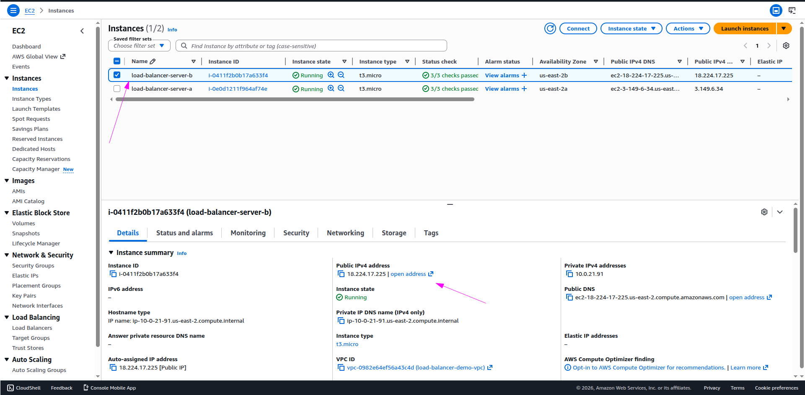

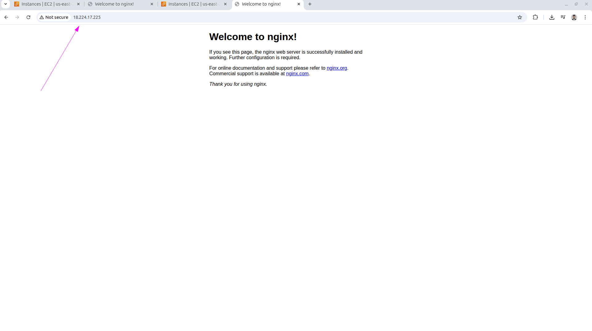

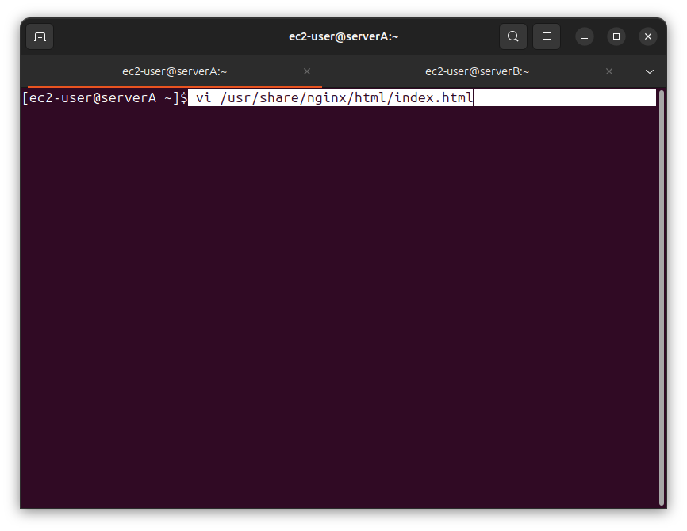

## 📌 Result

- ✔ Nginx successfully accessible via public IP
- ✔ Default page verified on both servers
- ✔ Custom HTML content applied
- ✔ Server A and Server B are now clearly identifiable from browser output
- ✔ Backend servers are fully ready for Load Balancer integration

  ...

  # 🟢 EC2 Target Group Issue Fix (Health Status: unused)

## ✅ তুমি যেগুলো করেছো (ঠিক আছে)
- EC2 Dashboard → Target Group এ গিয়েছো  
- Create Target Group করেছো  
  - Type: Instance  
  - Name: test-ec2-alb-demo-tg  
  - Protocol: HTTP (80)  
  - VPC: load-balancer-demo  
- 2টা EC2 instance attach করেছো  
- Create Target Group করেছো  

---

## ⚠️ সমস্যা
Health Status = unused

---

## 🔧 কারণ
- Target Group এখনো Load Balancer (ALB) এর সাথে যুক্ত হয়নি  
- তাই AWS এটাকে active traffic হিসেবে ধরছে না  

---

## 🔧 সমাধান

### 1. ALB এর সাথে attach করা
- Load Balancer এ যাও  
- Listener (HTTP :80) open করো  
- Forward rule এ target group select করো  
  - test-ec2-alb-demo-tg  

---

### 2. Health check path ঠিক করা
- ? ব্যবহার করা যাবে না  
- use করো: / অথবা /index.html  

---

### 3. Security Group check
- EC2 inbound rule এ HTTP 80 allow থাকতে হবে  
- Source হবে ALB security group  

---

### 4. Wait করো
- Attach করার পর 1–2 মিনিট অপেক্ষা  
- তারপর status update হবে  

---

## 📸 Screenshots

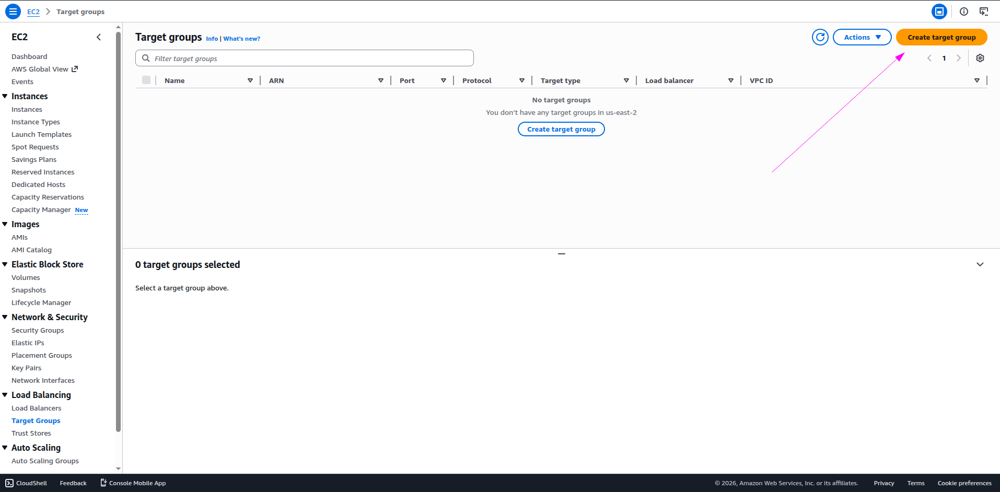

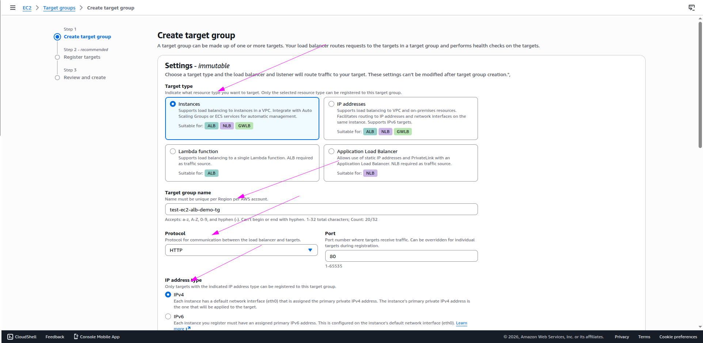

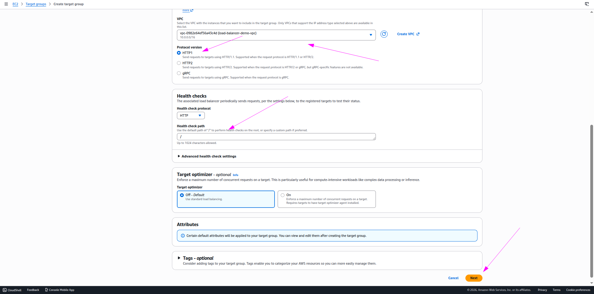

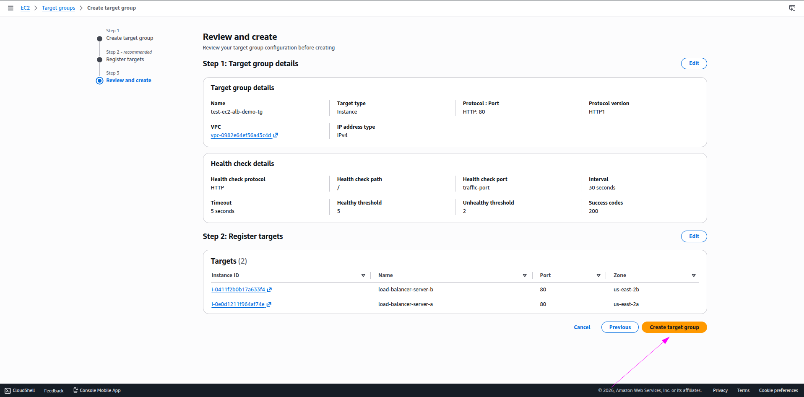

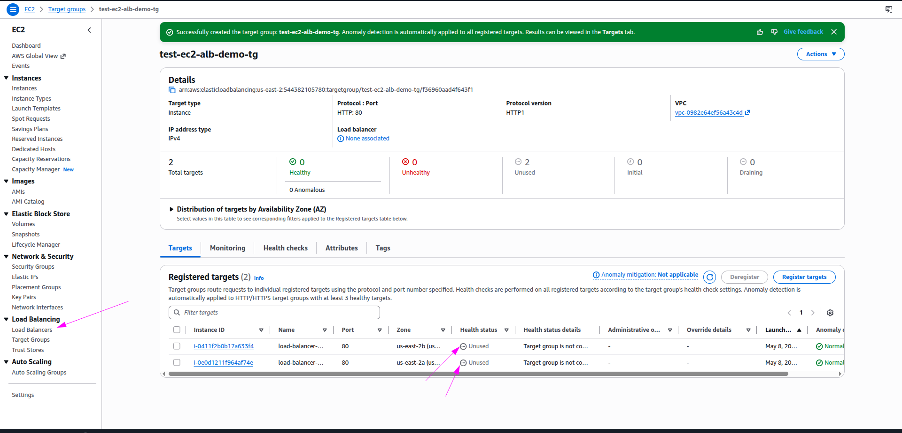

---

# 🚀 AWS Application Load Balancer (ALB) with EC2 Demo

## 📌 Overview
In this project, I used AWS Application Load Balancer (ALB) to distribute traffic between two EC2 instances. When the ALB DNS is accessed, requests are routed alternately between the servers.

---

## 🏗️ Step 1: Create Application Load Balancer

- Go to EC2 Dashboard → Load Balancers  
- Click **Create Load Balancer**  
- Select **Application Load Balancer**

### ⚙️ Configuration
- Name: `test-alb-for-ec2-demo`
- Scheme: Internet-facing
- IP type: IPv4

---

## 🌐 Step 2: Network Mapping

- VPC: `load-balancer-demo-vpc`
- Subnets:
  - AZ-1 subnet
  - AZ-2 subnet

👉 Two Availability Zones are used for High Availability

---

## 🔐 Step 3: Security Group (ALB SG)

- Created a new security group  
- Name: `alb-sg`  
- Description: `allows-access-from-internet`

### Inbound Rules:
- Type: HTTP  
- Port: 80  
- Source: `0.0.0.0/0`

👉 Attached `alb-sg` with the default security group

---

## 🎯 Step 4: Target Group Setup

- Name: `test-ec2-alb-demo-tg`
- Target type: Instance
- Protocol: HTTP
- VPC: `load-balancer-demo-vpc`

### Targets:
- EC2 Instance 1 → Server A  
- EC2 Instance 2 → Server B  

---

## ❤️ Step 5: Health Check

- HTTP health check enabled  
- Status: Healthy

---

## 🔗 Step 6: Listener & Routing

- Listener: HTTP : 80  
- Forward to: `test-ec2-alb-demo-tg`

---

## 🚀 Step 7: Create Load Balancer

- Created the load balancer successfully  
- Status: Active

---

## 🌍 Testing Result

When accessing the ALB DNS in the browser:

- First request → Server A (Welcome to Server A)  
- Refresh → Server B (This is Server B)

👉 Traffic is automatically distributed between instances

---

## 📸 Screenshots (AWS ALB Setup)

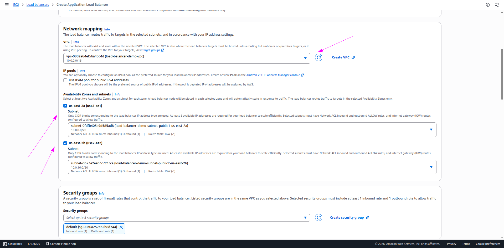

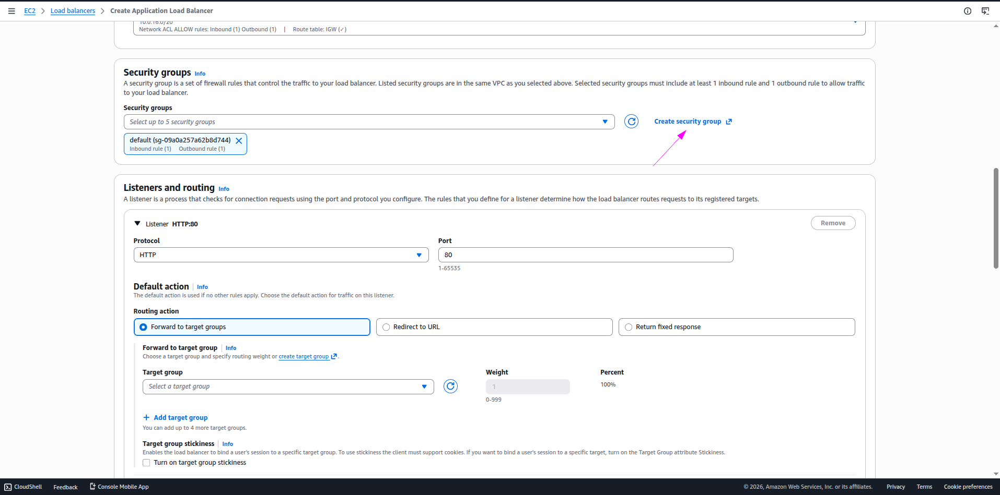

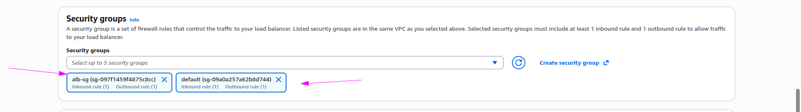

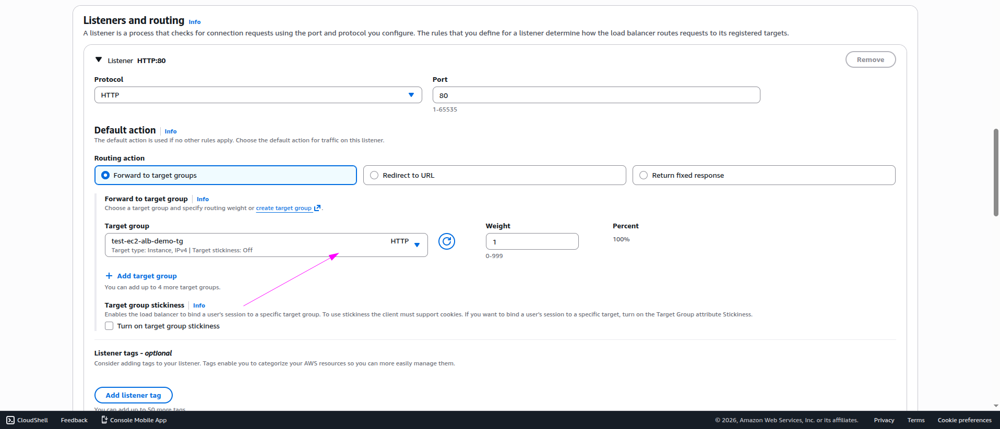

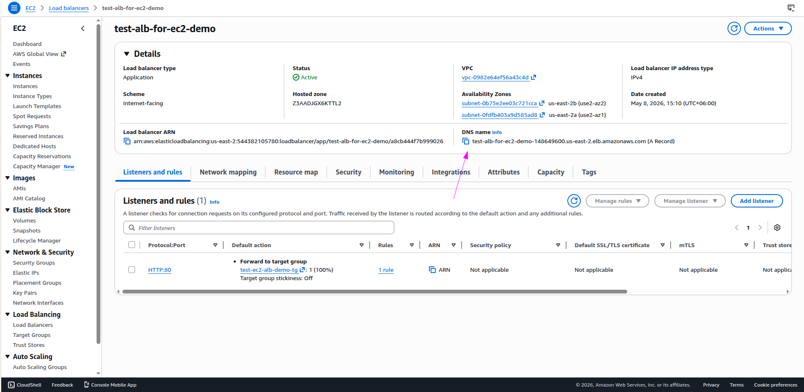

## 📌 Summary

- ALB is configured successfully  
- Two EC2 instances are attached  
- Multi-AZ architecture is used  
- Security group allows HTTP traffic  
- Single DNS is used for multiple servers
  ...
  
---

## 🟢 Final Result

- ✔ VPC fully configured  
- ✔ EC2 instances running  
- ✔ Nginx deployed successfully  
- ✔ Target Group healthy  
- ✔ ALB active and working  
- ✔ Load balancing verified  
- ✔ Multi-AZ high availability achieved  

---

## 🧠 Key Learning

- AWS networking (VPC, Subnets, IGW)
- EC2 deployment & configuration
- Load balancing concept (ALB)
- Health checks & target groups
- Security group configuration
- High availability architecture design
