# ☁️ AWS Highly Available Load Balanced Architecture with WAF Security

## 🎯 Project Goal

This project demonstrates how to build a **Highly Available, Secure, and Scalable Web Architecture** using AWS services:

- VPC (Networking Foundation)
- EC2 Instances (Backend Servers)
- Nginx Web Server
- Application Load Balancer (ALB)
- Target Groups (Traffic Distribution)
- AWS WAF (Web Application Firewall)
- Geo-based Access Control
- CAPTCHA Protection
- Security Group Configuration

The goal is to simulate a **real-world production environment** with:

- High Availability (Multi-AZ deployment)
- Load Balancing (Traffic distribution across servers)
- Security Hardening (WAF protection against attacks)
- Geographic Access Control (Geo blocking rules)
- Scalable backend architecture

---

## 🚀 Step 1: VPC Creation

I went to the AWS Console and opened the VPC Dashboard. Then I created a new VPC using the **Create VPC → VPC and more** option.

## ⚙️ VPC Configuration

- 🏷️ Name: `load-balancer-demo`
- 🌐 IPv4 CIDR: `10.0.0.0/16`
- 🧾 Tenancy: Default
- 🌍 Availability Zones: 2
- 📡 Public Subnets: 2
- 🔒 Private Subnets: 0
- 🚫 NAT Gateway: None
- 🚫 VPC Endpoint: None

## ✅ Result

The VPC was successfully created.

- ✔️ 2 Public Subnets in 2 Availability Zones
- 🌐 Internet Gateway (IGW) attached
- 🛣️ Route Table (RT) created and configured

## 📸 Screenshots

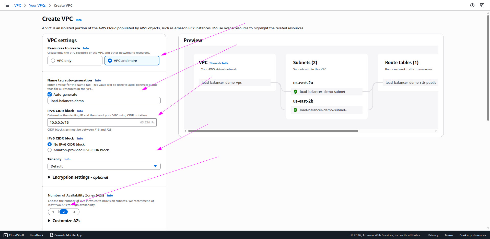

---

# 🖥️ AWS EC2 Instance Setup for Load Balancer

## 🚀 Step 2: EC2 Instance Creation

I went to the AWS EC2 Dashboard and launched two EC2 instances using the **Launch Instance** option.

---

## 🖥️ Instance 1: load-balancer-server-a

### ⚙️ Configuration:
- 🏷️ Name: `load-balancer-server-a`
- 🐧 OS Image: Amazon Linux
- 💻 Instance Type: `t3.micro`
- 🔑 Key Pair: `load-balancer-demo`

### 🌐 Network Settings:
- ☁️ VPC: `load-balancer-demo`
- 🌍 Availability Zone: `us-east-2a`
- 📡 Subnet: Public Subnet (AZ-a)
- 🌐 Auto-assign Public IP: Enabled

### 🔐 Security Group:
- 🔑 SSH (22) → Source: `0.0.0.0/0`
- 🌐 HTTP (80) → Source: `0.0.0.0/0`

---

## 🖥️ Instance 2: load-balancer-server-b

### ⚙️ Configuration:
- 🏷️ Name: `load-balancer-server-b`
- 🐧 OS Image: Amazon Linux
- 💻 Instance Type: `t3.micro`
- 🔑 Key Pair: `load-balancer-demo`

### 🌐 Network Settings:
- ☁️ VPC: `load-balancer-demo`
- 🌍 Availability Zone: `us-east-2b`
- 📡 Subnet: Public Subnet (AZ-b)
- 🌐 Auto-assign Public IP: Enabled

### 🔐 Security Group:
- 🔑 SSH (22) → Source: `0.0.0.0/0`
- 🌐 HTTP (80) → Source: `0.0.0.0/0`

---

## 📸 Screenshots

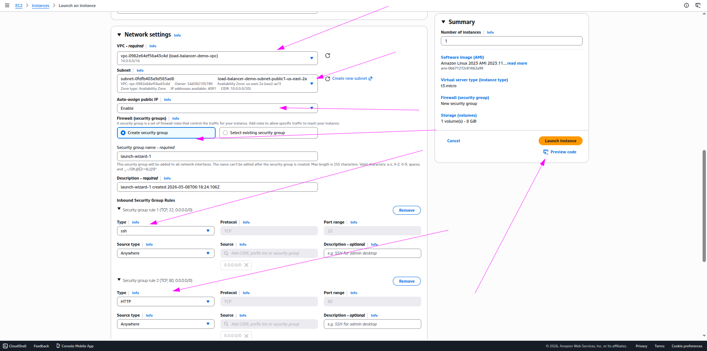

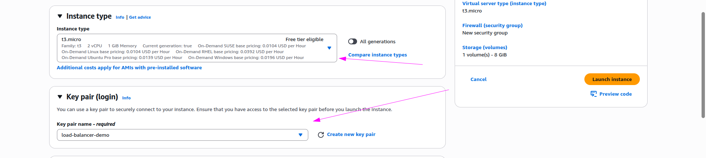

---

# 🖥️ EC2 Access & Nginx Setup (Load Balancer Backend Servers)

## 🚀 Step 3: SSH Access to EC2 Instances

I accessed the EC2 instances from my local terminal. I navigated to the Downloads folder where the `.pem` key file was stored. Then I secured the key file permissions and connected to both EC2 instances using SSH.

---

## 🔐 Server Naming Setup

### 🖥️ Server A
- After logging into the first EC2 instance, I changed the hostname to `serverA`
- I exited and reconnected via SSH to verify the hostname in the terminal
- This helped clearly identify which server I was working on

### 🖥️ Server B
- I repeated the same process on the second EC2 instance
- The hostname was changed to `serverB`
- Reconnected via SSH to confirm the change

---

## 👤 Root Access & System Update

- I switched to root user on both servers
- I updated the system packages to the latest version

---

## 🌐 Nginx Installation & Setup

### 🖥️ Server A
- Installed Nginx
- Started Nginx service
- Enabled Nginx service to start automatically on reboot

### 🖥️ Server B
- Installed Nginx
- Started Nginx service
- Enabled Nginx service to start automatically on reboot

---

## 📸 Screenshots

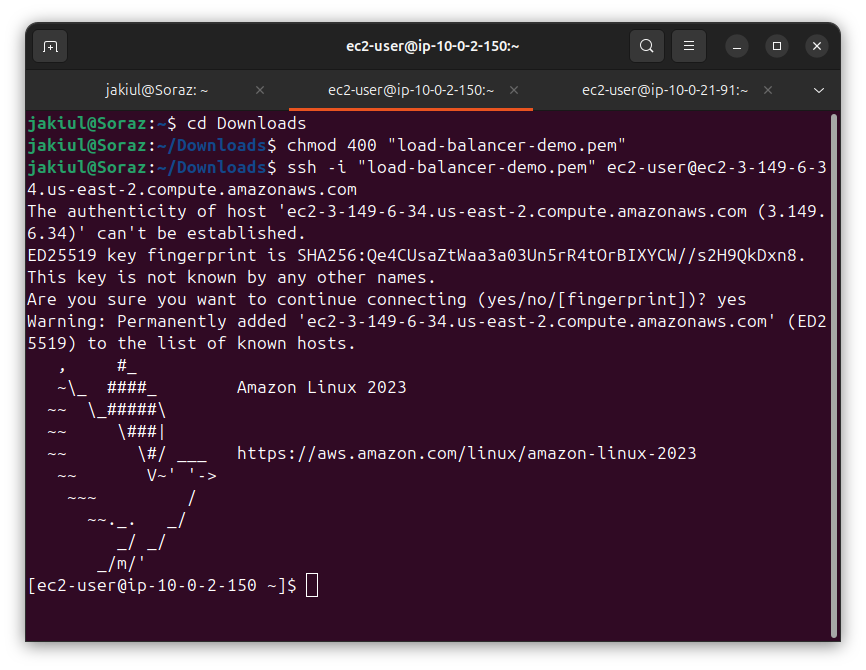

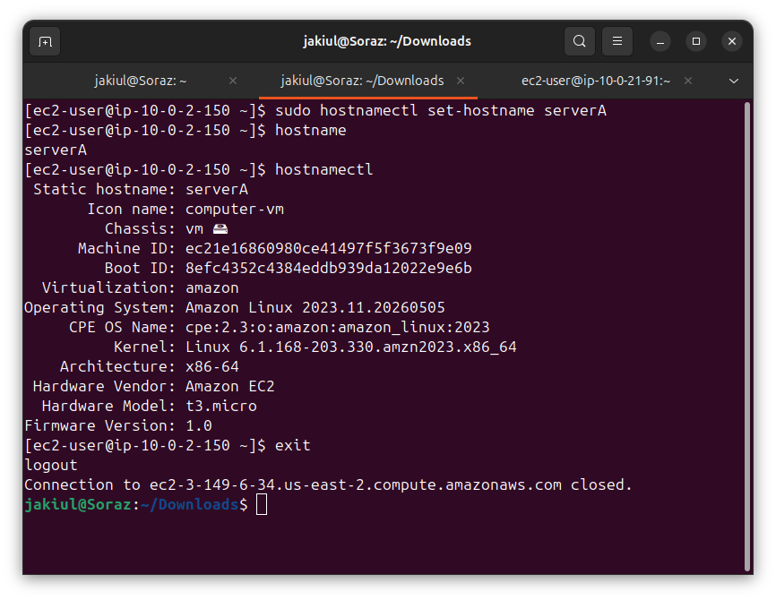

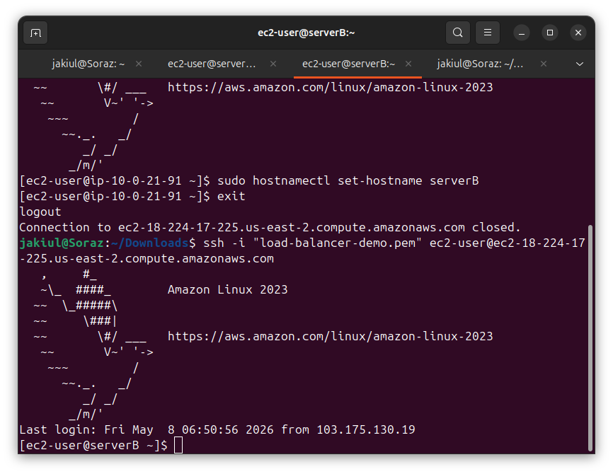

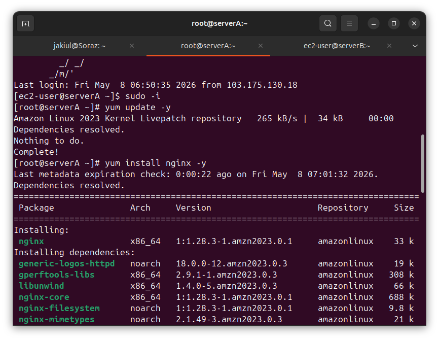

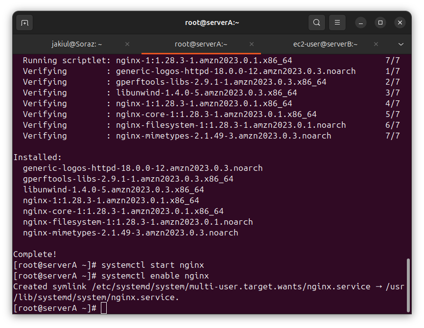

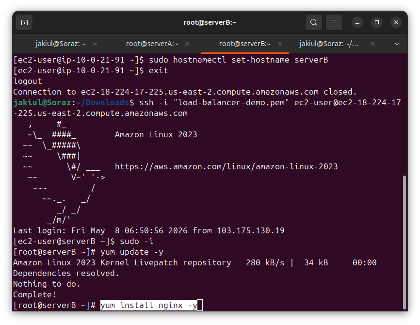

---

## 📌 Result

- ✔ Successfully accessed both EC2 instances via SSH  
- ✔ Hostnames configured as serverA and serverB  
- ✔ System packages updated  
- ✔ Nginx installed and running on both servers  
- ✔ Both servers are ready to serve web traffic behind a load balancer

  # 🌐 Nginx Verification on EC2 Instances

## 🚀 Step 4: Browser Test (Public IP Access)

I accessed both EC2 instances using their public IP addresses from the browser to verify Nginx.

At first, the default Nginx welcome page was displayed on both servers.

Then I modified the default HTML page on both instances.

- On the first server, I changed the message to **"Welcome to Server A"**
- On the second server, I changed the message to **"This is Server B"**

This helped clearly identify both servers through the browser.

---

## 📸 Screenshots

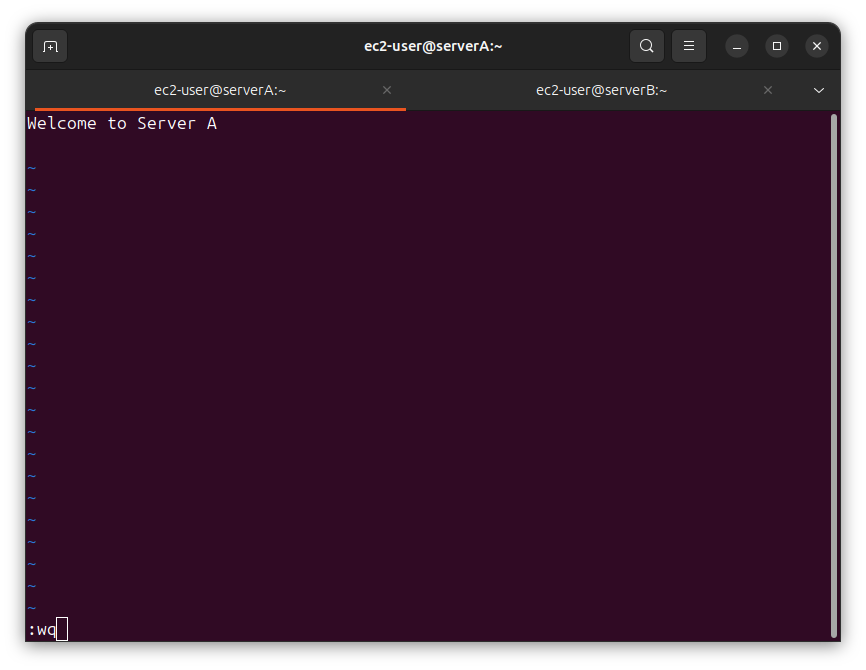

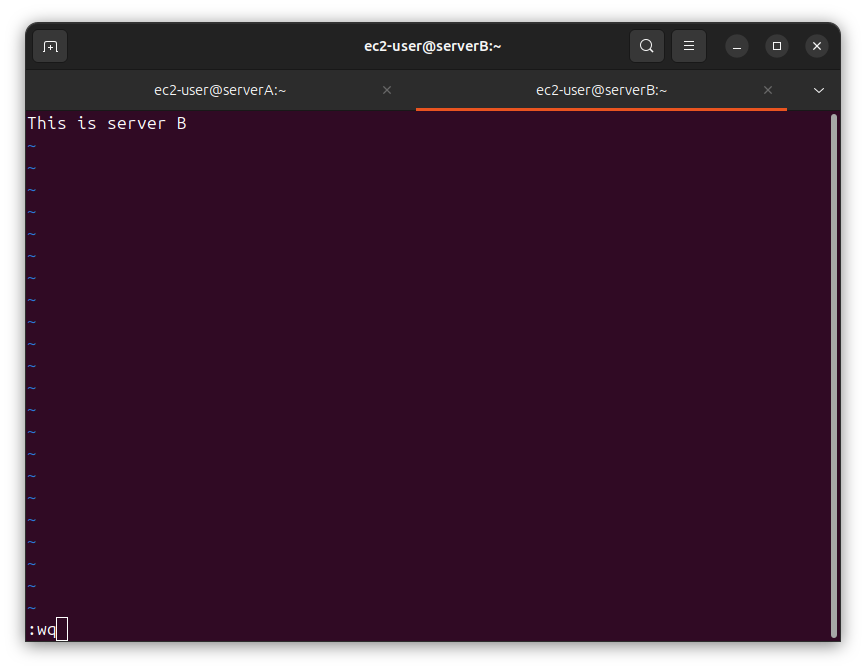

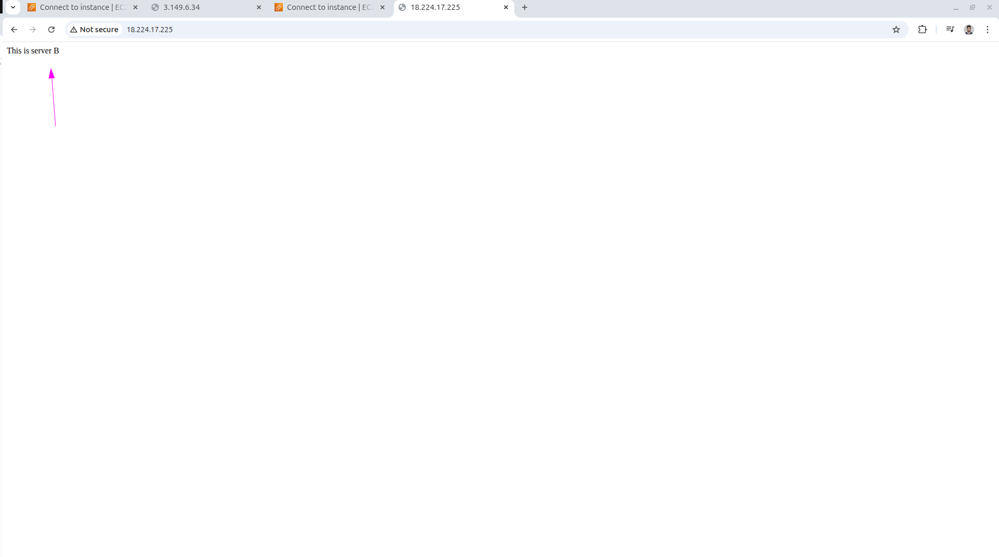

## 📌 Result

- ✔ Nginx successfully accessible via public IP
- ✔ Default page verified on both servers
- ✔ Custom HTML content applied
- ✔ Server A and Server B are now clearly identifiable from browser output
- ✔ Backend servers are fully ready for Load Balancer integration

  ...

  ## 🟢 EC2 Target Group Issue Fix (Health Status: unused)

## ✅ Completed Configuration
- Opened EC2 Dashboard → Target Groups  
- Created a new Target Group  
  - Target Type: Instance  
  - Name: `test-ec2-alb-demo-tg`  
  - Protocol: HTTP (80)  
  - VPC: `load-balancer-demo`  
- Attached two EC2 instances  
- Successfully created the Target Group  

---

## ⚠️ Issue

The Target Group health status showed:

`unused`

---

## 🔧 Reason

The Target Group was not yet attached to an Application Load Balancer (ALB).  
Because of this, AWS did not consider it as an active traffic destination.

---

## 🔧 Solution

### 1️⃣ Attach the Target Group to the ALB

- Open the **Load Balancer**
- Go to the **Listener (HTTP :80)**
- Edit the forward rule
- Select the target group:
  - `test-ec2-alb-demo-tg`

---

### 2️⃣ Configure Correct Health Check Path

Instead of using:

`?`

Use:

`/`

or

`/index.html`

---

### 3️⃣ Verify Security Group Rules

The EC2 instance security group must allow:

- HTTP Port 80
- Source: ALB Security Group

---

### 4️⃣ Wait for Health Check Update

After attaching the Target Group:

- Wait 1–2 minutes
- AWS health checks will run automatically
- Status will change from `unused` to `healthy`

---

## 📸 Screenshots

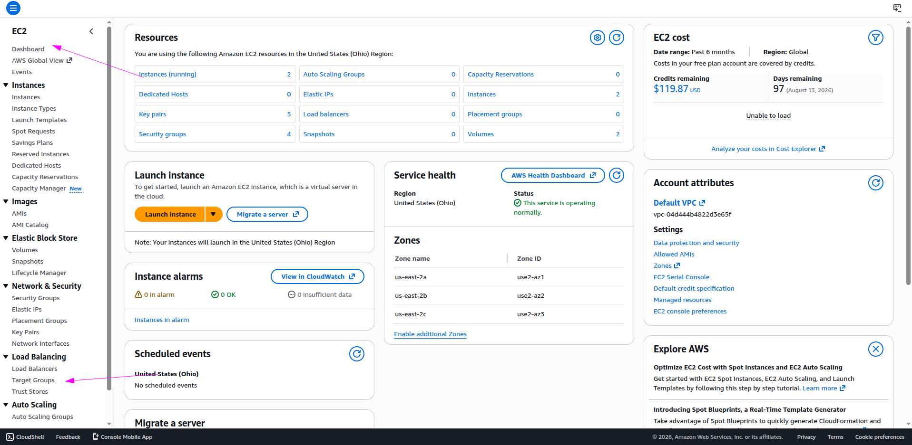

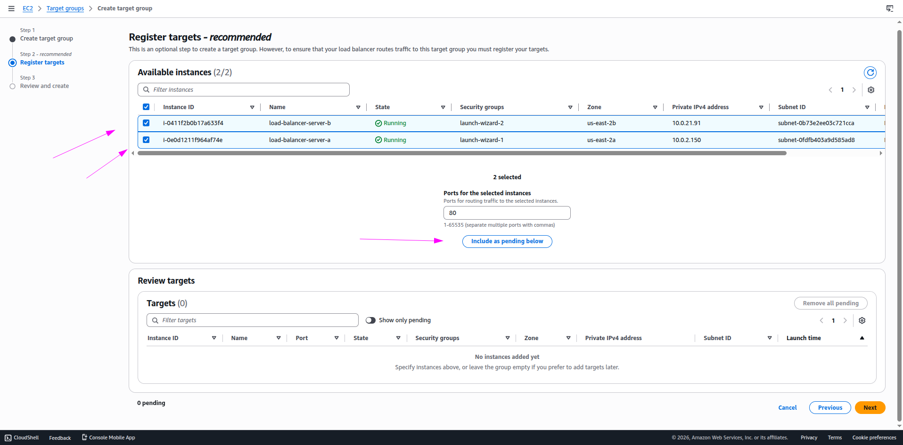

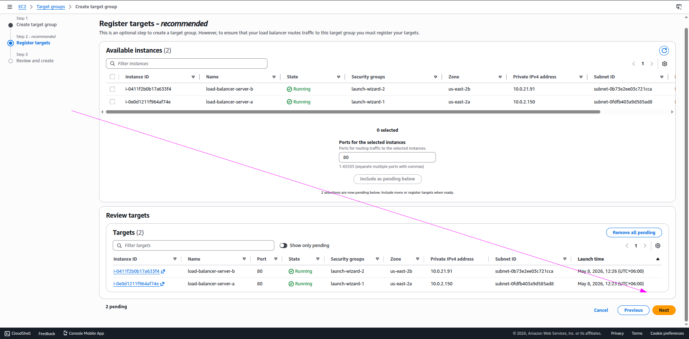

---

# 🚀 AWS Application Load Balancer (ALB) with EC2 Demo

## 📌 Overview
In this project, I used AWS Application Load Balancer (ALB) to distribute traffic between two EC2 instances. When the ALB DNS is accessed, requests are routed alternately between the servers.

---

## 🏗️ Step 1: Create Application Load Balancer

- Go to EC2 Dashboard → Load Balancers  
- Click **Create Load Balancer**  
- Select **Application Load Balancer**

### ⚙️ Configuration
- Name: `test-alb-for-ec2-demo`
- Scheme: Internet-facing
- IP type: IPv4

---

## 🌐 Step 2: Network Mapping

- VPC: `load-balancer-demo-vpc`
- Subnets:
  - AZ-1 subnet
  - AZ-2 subnet

👉 Two Availability Zones are used for High Availability

---

## 🔐 Step 3: Security Group (ALB SG)

- Created a new security group  
- Name: `alb-sg`  
- Description: `allows-access-from-internet`

### Inbound Rules:
- Type: HTTP  
- Port: 80  
- Source: `0.0.0.0/0`

👉 Attached `alb-sg` with the default security group

---

## 🎯 Step 4: Target Group Setup

- Name: `test-ec2-alb-demo-tg`
- Target type: Instance
- Protocol: HTTP
- VPC: `load-balancer-demo-vpc`

### Targets:
- EC2 Instance 1 → Server A  
- EC2 Instance 2 → Server B  

---

## ❤️ Step 5: Health Check

- HTTP health check enabled  
- Status: Healthy

---

## 🔗 Step 6: Listener & Routing

- Listener: HTTP : 80  
- Forward to: `test-ec2-alb-demo-tg`

---

## 🚀 Step 7: Create Load Balancer

- Created the load balancer successfully  
- Status: Active

---

## 🌍 Testing Result

When accessing the ALB DNS in the browser:

- First request → Server A (Welcome to Server A)  
- Refresh → Server B (This is Server B)

👉 Traffic is automatically distributed between instances

---

## 📸 Screenshots (AWS ALB Setup)

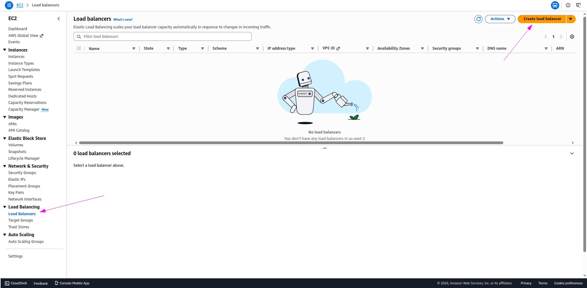

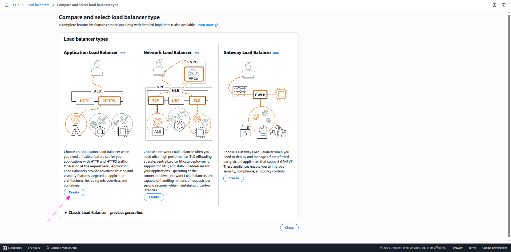

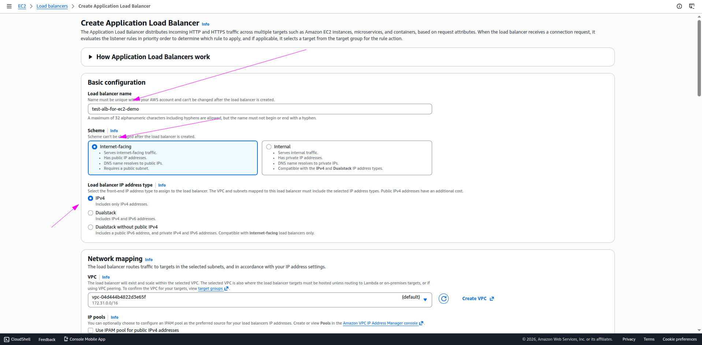

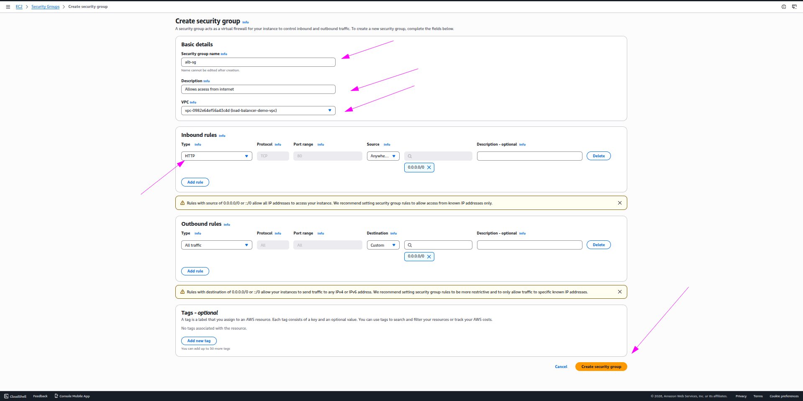

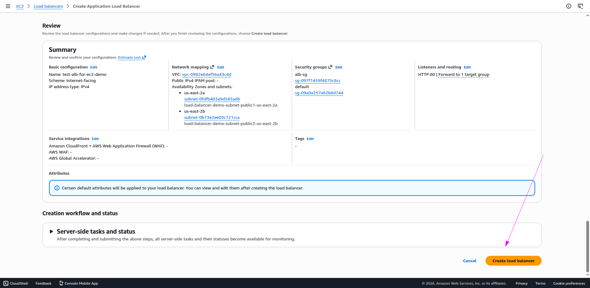

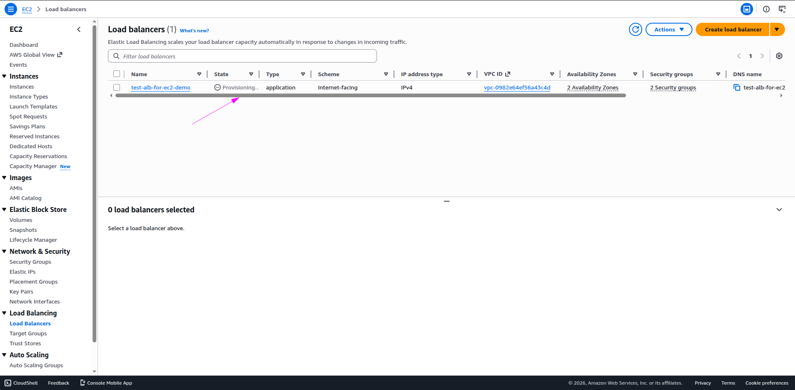

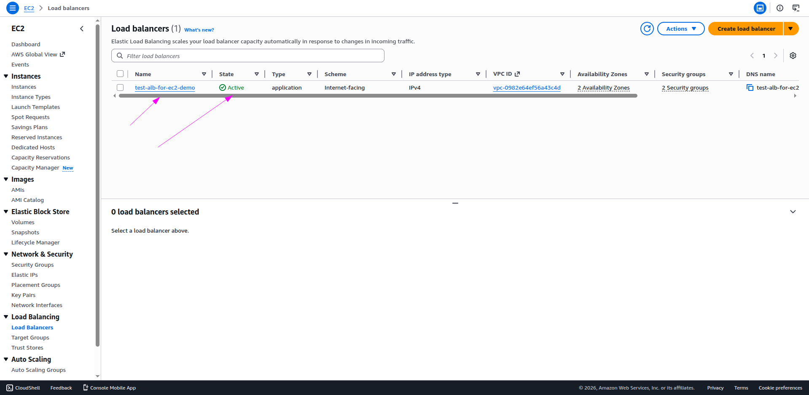

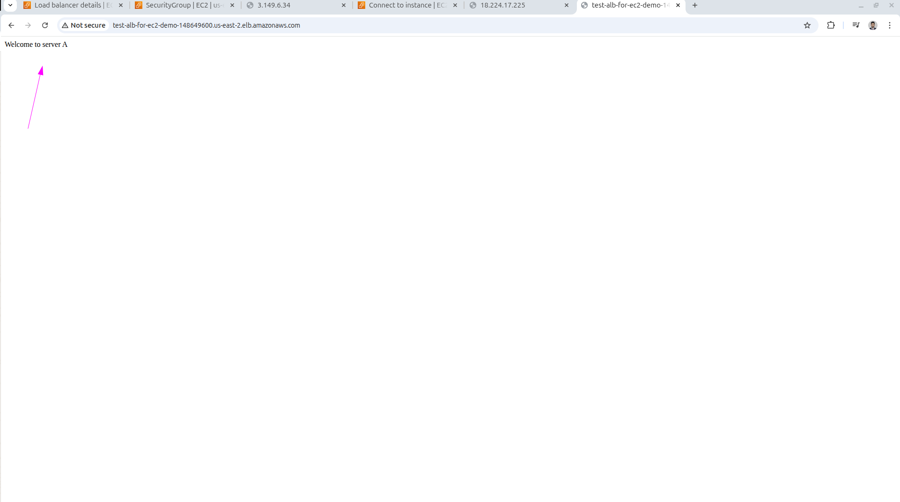

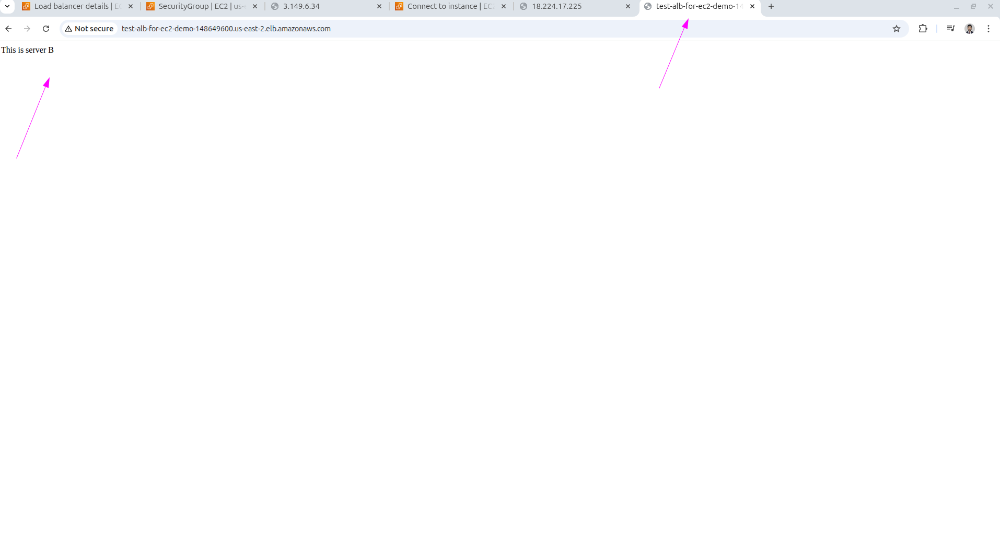

## 📌 Summary

- ALB is configured successfully  
- Two EC2 instances are attached  
- Multi-AZ architecture is used  
- Security group allows HTTP traffic  
- Single DNS is used for multiple servers
  ...
  
---

## 🟢 Final Result

- ✔ VPC fully configured  
- ✔ EC2 instances running  
- ✔ Nginx deployed successfully  
- ✔ Target Group healthy  
- ✔ ALB active and working  
- ✔ Load balancing verified  
- ✔ Multi-AZ high availability achieved  

---

# 🛡️ AWS WAF Integration with Application Load Balancer

## 🚀 Step 8: Configure AWS WAF for ALB Protection

After successfully configuring the Application Load Balancer (ALB), I added AWS WAF protection to improve security against malicious traffic and common web attacks.

---

## 🛠️ Step 1: Open AWS WAF & Shield

- Opened the AWS Console
- Navigated to:
  - **AWS WAF & Shield**
- Clicked on:
  - **Create Protection Pack**

---

## ⚙️ Step 2: Configure Application Settings

### 📌 Application Category
- Selected:
  - `Others`

### 🎯 Application Focus
- Selected:
  - `Both API and Web`

This configuration enables protection for both web applications and API traffic.

---

## 🌐 Step 3: Add Regional Resources

Under the **Add Resources** section:

- Selected:
  - `Add Regional Resources`

Then I chose my existing Application Load Balancer:

### 🔗 Selected Resource
- `test-alb-for-ec2-demo`

This associated AWS WAF directly with the ALB.

---

## 🏷️ Step 4: Create Web ACL

### ⚙️ Configuration
- Web ACL Name:
  - `aws-ec2-elb-waf-demo`

- Scope:
  - Regional

After reviewing the settings, I clicked:

- ✅ **Create Web ACL**

---

## 🔒 Step 5: WAF Protection Enabled

The Web ACL was successfully created and attached to the Application Load Balancer.

Now the ALB is protected against:

- Common web exploits
- Suspicious HTTP requests
- Basic malicious traffic patterns

---

## 📸 Screenshots

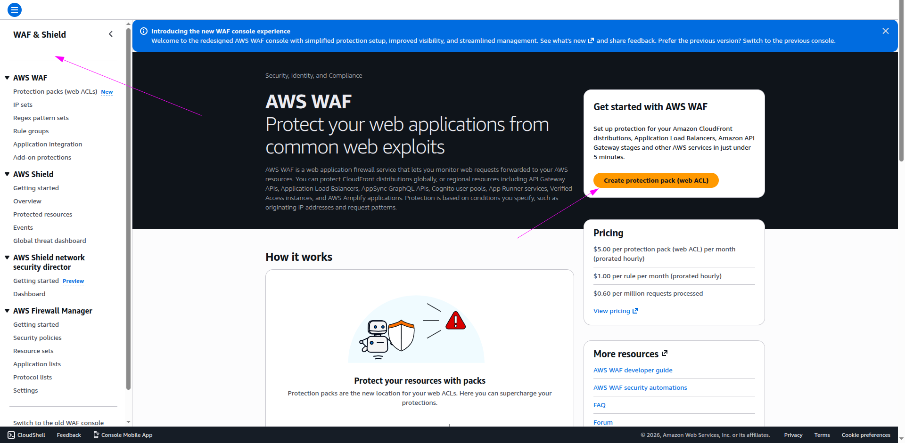

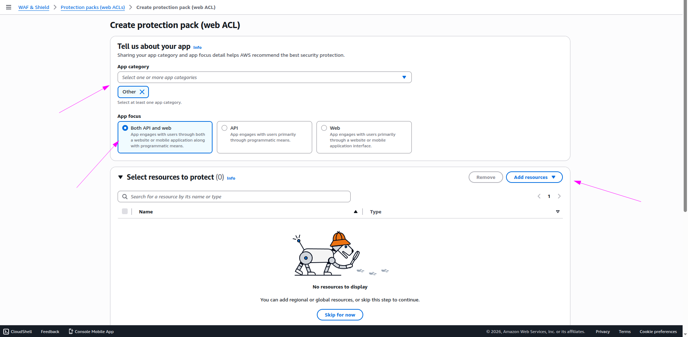

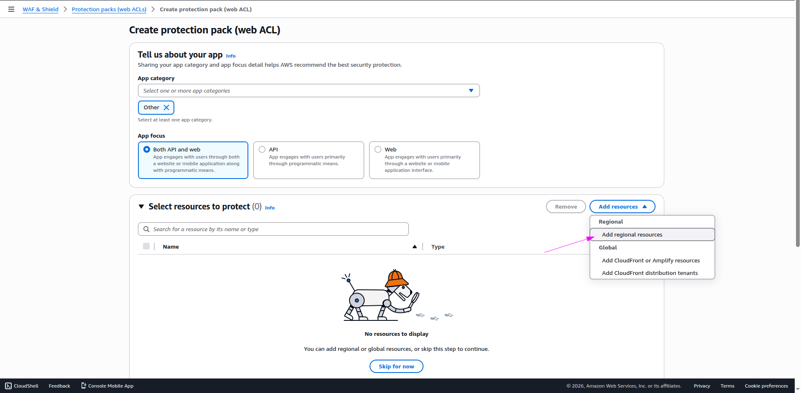

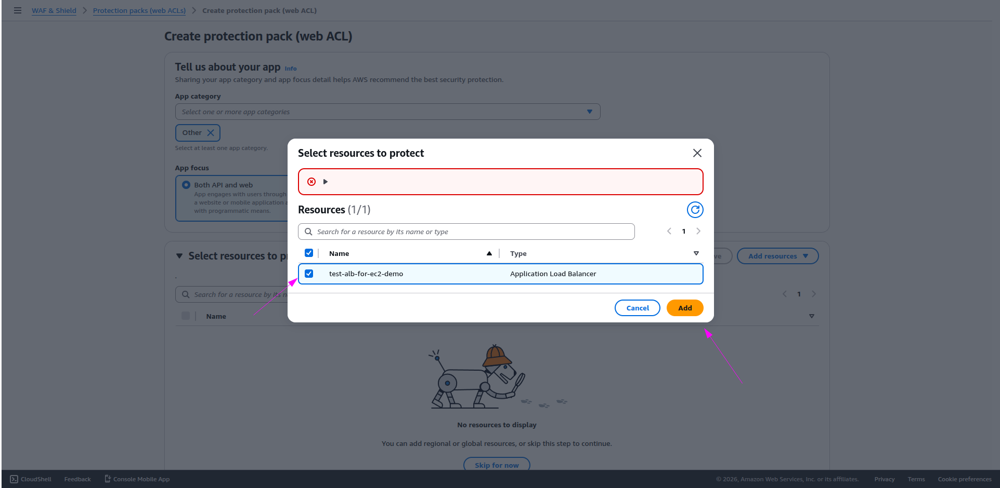

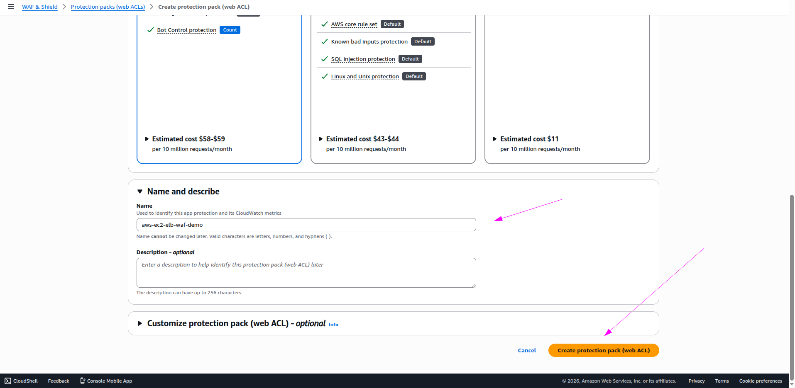

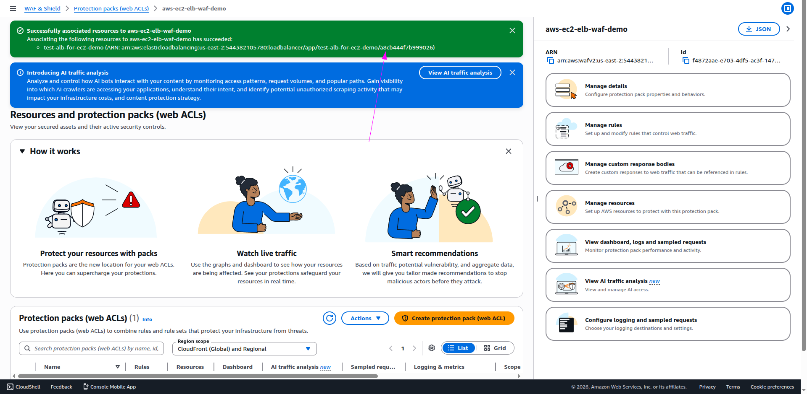

---

## ✅ Result

- ✔ AWS WAF configured successfully  
- ✔ Web ACL attached to ALB  
- ✔ Regional protection enabled  
- ✔ API and Web traffic protection configured  
- ✔ Application security improved  

---

## 🧠 Key Learning

- AWS WAF configuration process  
- Creating and managing Web ACLs  
- Associating ALB with WAF  
- Regional resource protection  
- Enhancing AWS application security

  ---

  # 🌍 AWS WAF Custom Geo Match Rule Configuration

## 🚀 Step 9: Configure Custom WAF Rules

After successfully attaching AWS WAF with the Application Load Balancer, I configured custom security rules to control traffic based on geographic location.

---

## 🛠️ Step 1: Open Web ACL Rules

- Opened the existing Web ACL:
  - `aws-ec2-elb-waf-demo`
- Navigated to:
  - **Rules**
- Clicked:
  - **Add Rules**
  - **Add My Own Rules and Rule Groups**

---

## 🌍 Step 2: Create Geo Match Rule

### ⚙️ Rule Configuration
- Rule Type:
  - `Geo Match Rule`

- Rule Name:
  - `block`

### 🌐 Country Selection
- Selected Country:
  - `Bangladesh (BD)`

### 🚫 Action
- Action:
  - `Block`

After configuring the rule, I saved the changes successfully.

---

## 🔒 Step 3: Verify Block Action

When accessing the ALB DNS from the browser after enabling the block rule:

- The application displayed:
  - `403 Forbidden`

This confirmed that AWS WAF was successfully blocking requests from the selected geographic region.

---

## 🤖 Step 4: Change Rule Action to CAPTCHA

To test another WAF protection mechanism:

- Edited the existing rule
- Changed action from:
  - `Block`
- To:
  - `CAPTCHA`

### 🏷️ Updated Rule Name
- `captcha`

After saving the rule, the browser displayed a CAPTCHA verification page before allowing access.

This confirmed that AWS WAF CAPTCHA protection was working correctly.

---

## ✅ Step 5: Allow Traffic Again

Finally, I modified the rule action again.

### ⚙️ Updated Configuration
- Action:
  - `Allow`

### 🏷️ Rule Name
- `allow`

After saving the changes:

- The ALB became accessible again
- Traffic was distributed normally between both EC2 instances

### 🌐 Browser Result
- First refresh:
  - `Welcome to Server A`
- Next refresh:
  - `This is Server B`

This verified that the Application Load Balancer and backend servers were functioning correctly after the WAF rule updates.

---

## 📸 Screenshots

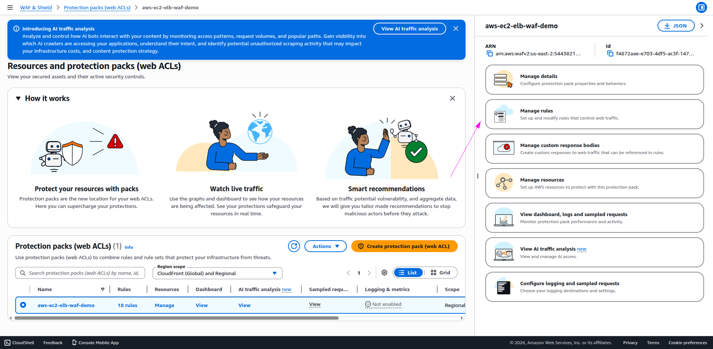

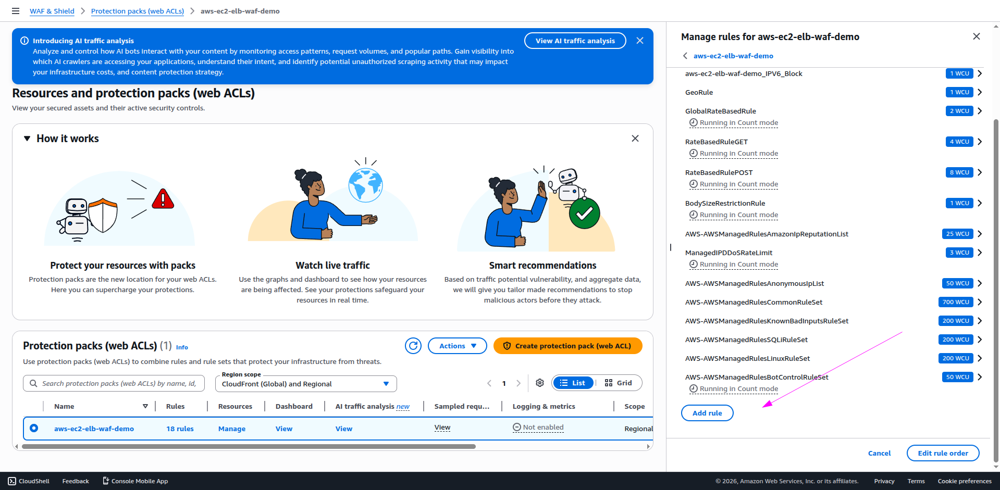

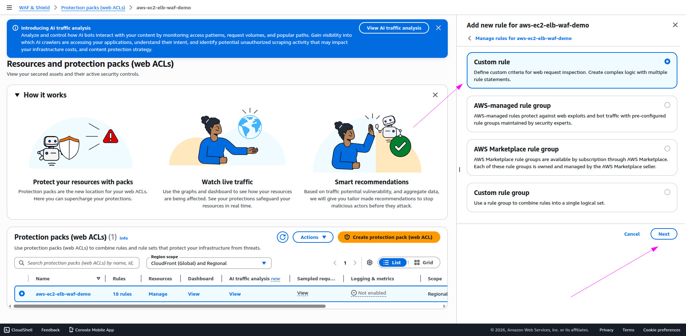

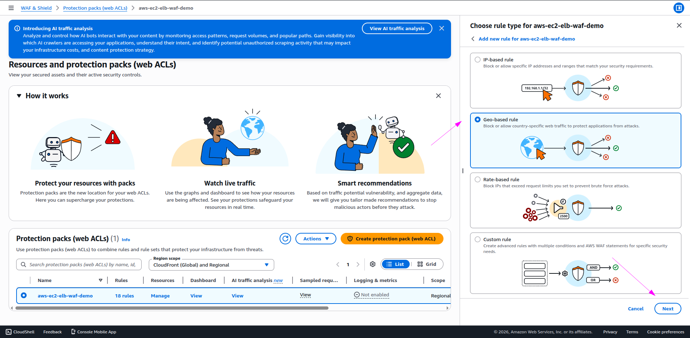

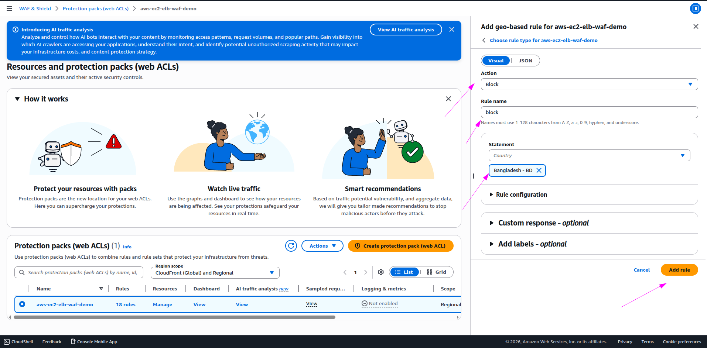

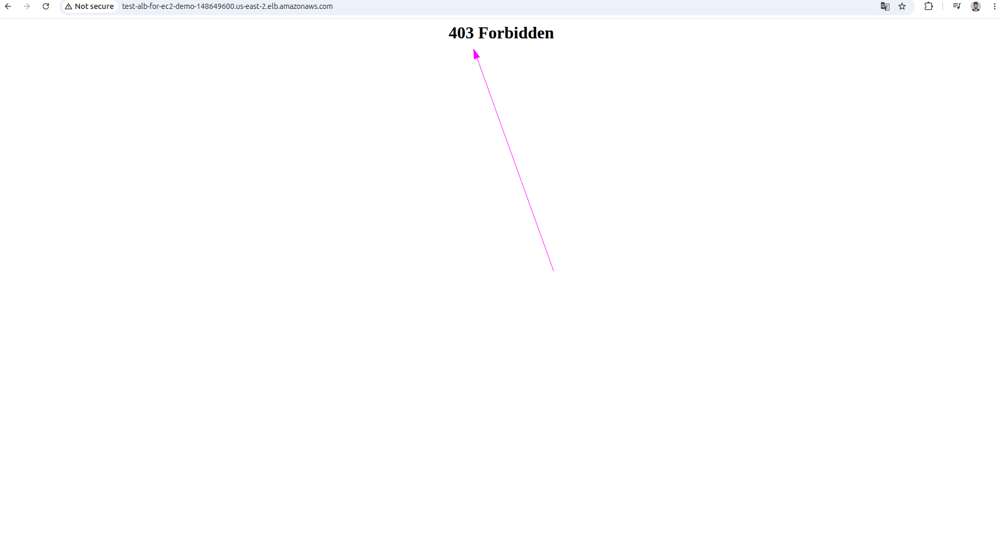

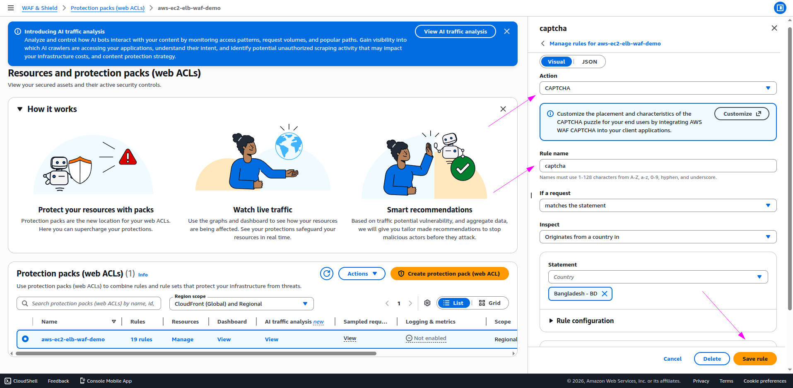

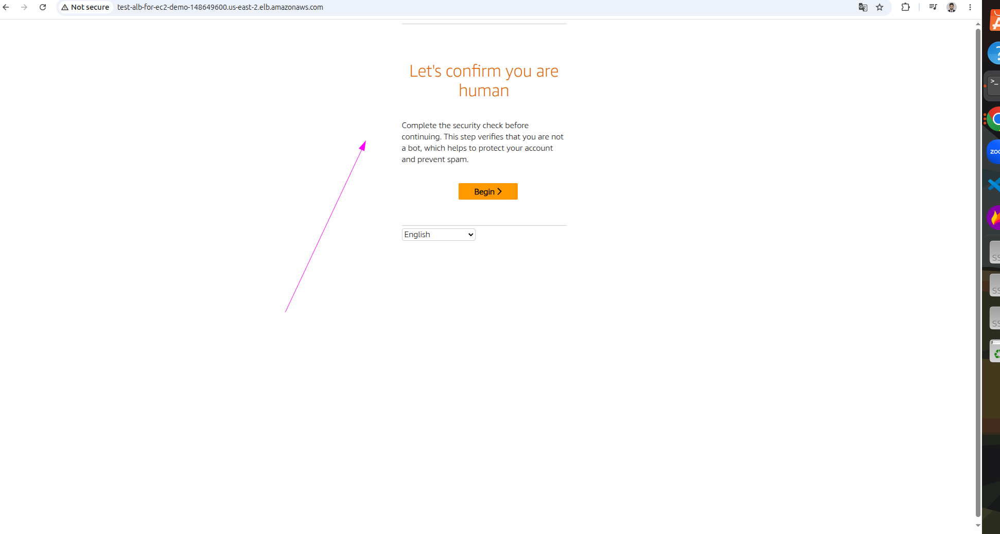

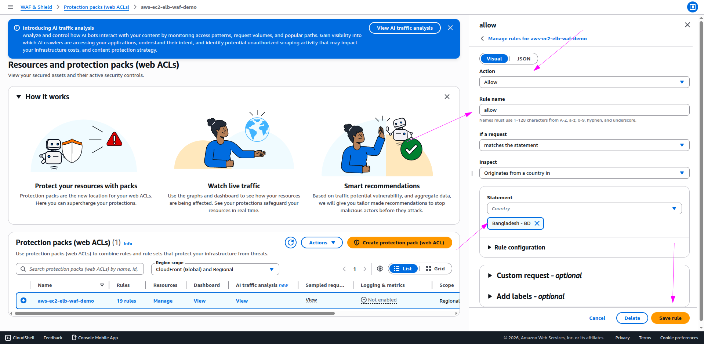

---

## ✅ Result

- ✔ Custom Geo Match Rule configured  
- ✔ Country-based traffic filtering tested  
- ✔ 403 Forbidden response verified  
- ✔ CAPTCHA protection enabled successfully  
- ✔ Traffic restored using Allow rule  
- ✔ Load Balancer functionality verified  

---

## 🧠 Key Learning

- AWS WAF custom rule configuration  
- Geo Match Rule setup  
- Country-based traffic filtering  
- CAPTCHA protection using AWS WAF  
- Managing WAF rule actions  
- Testing ALB security behavior

  

