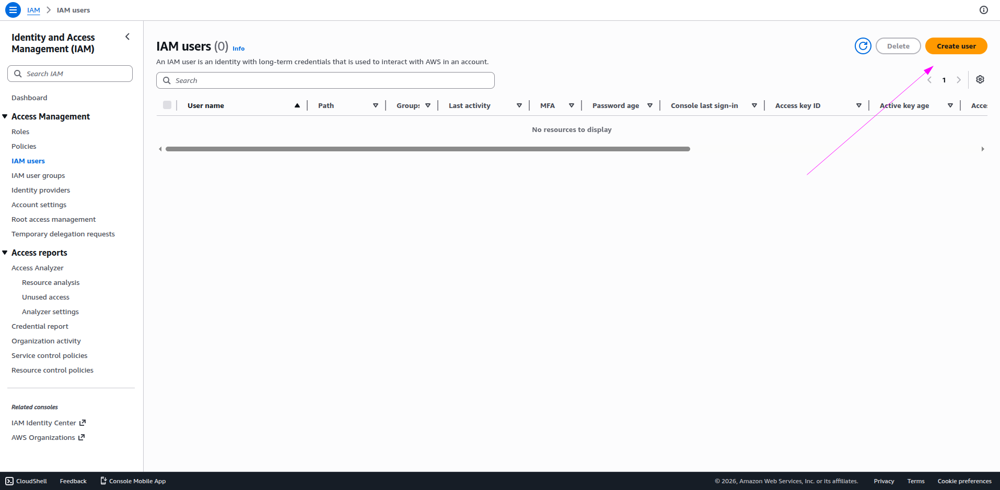
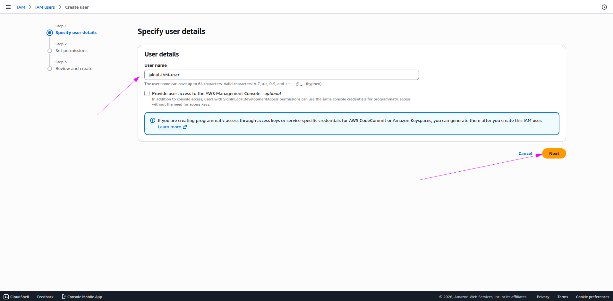
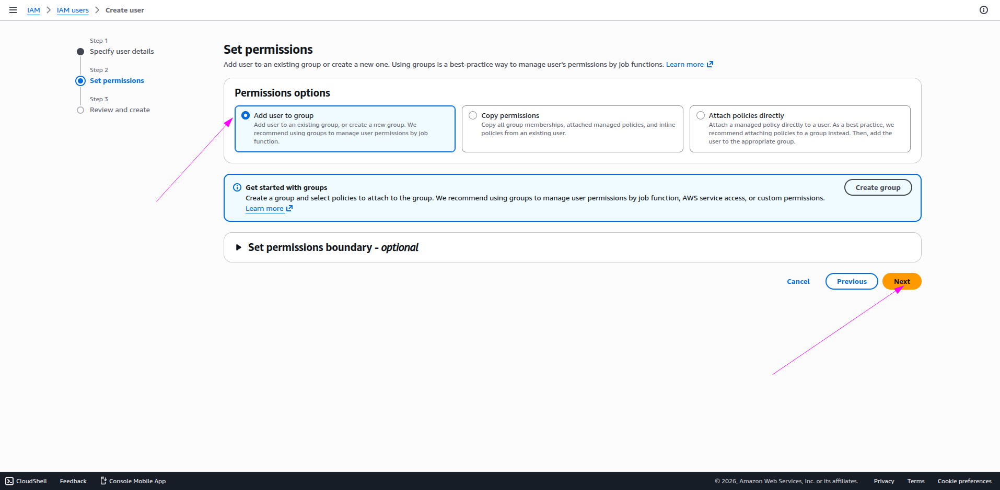
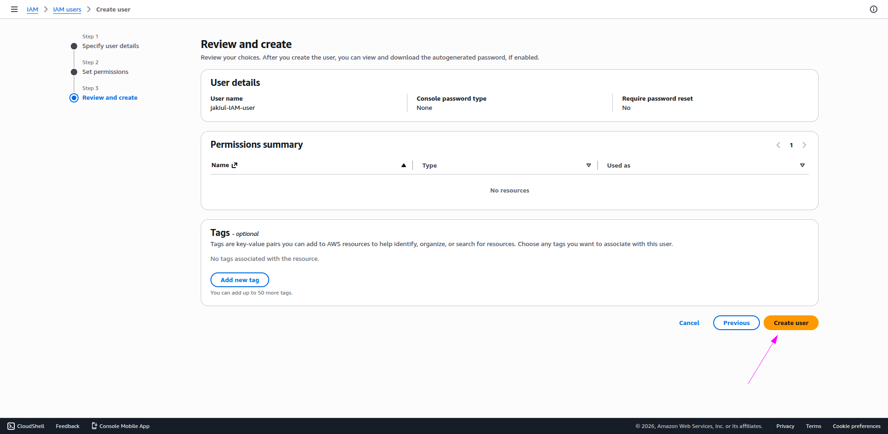
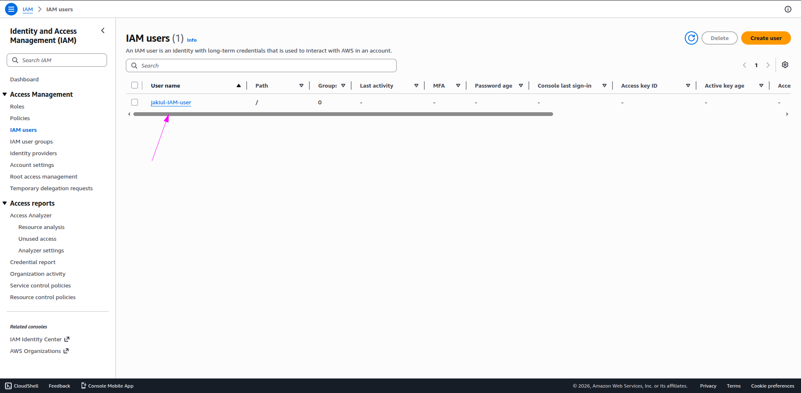
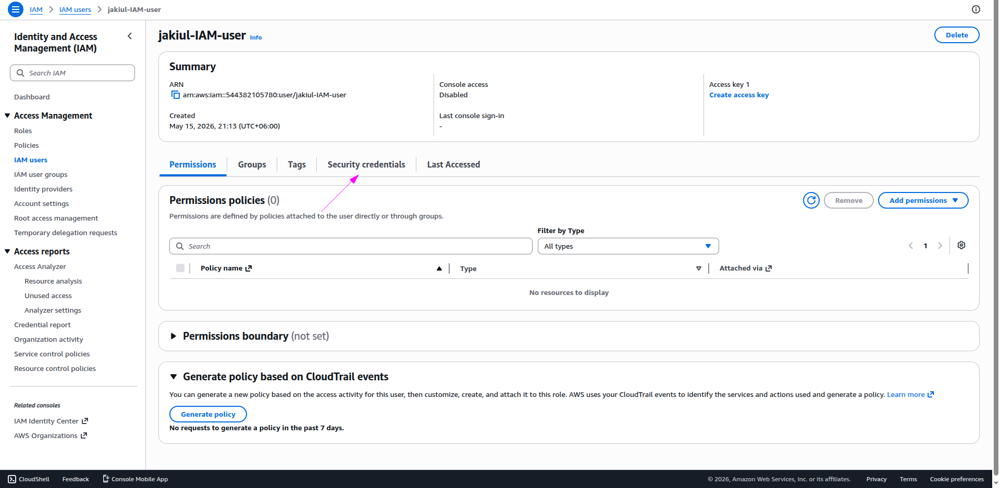
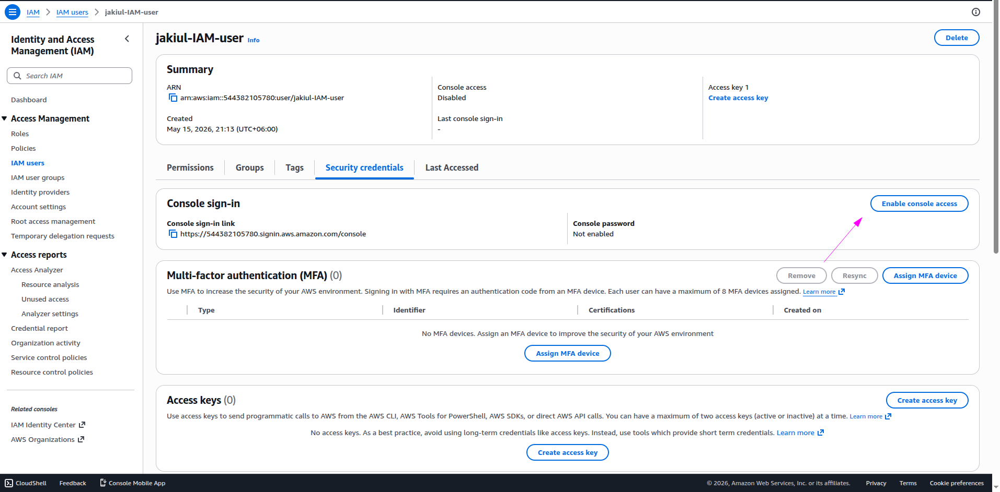
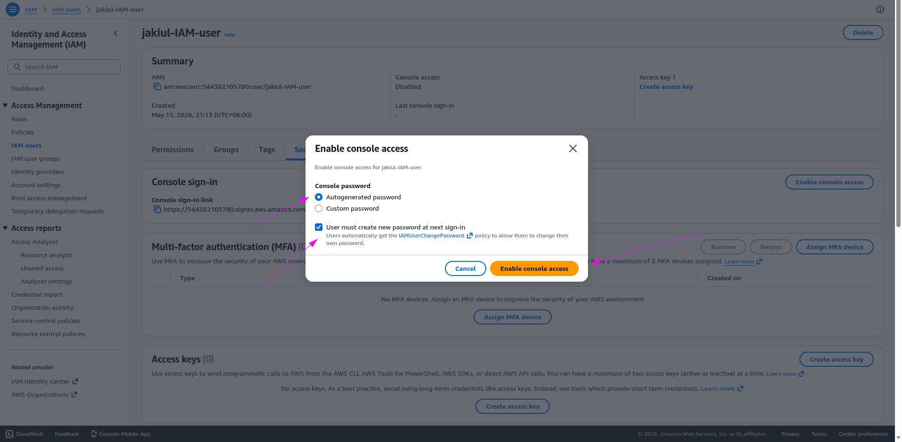
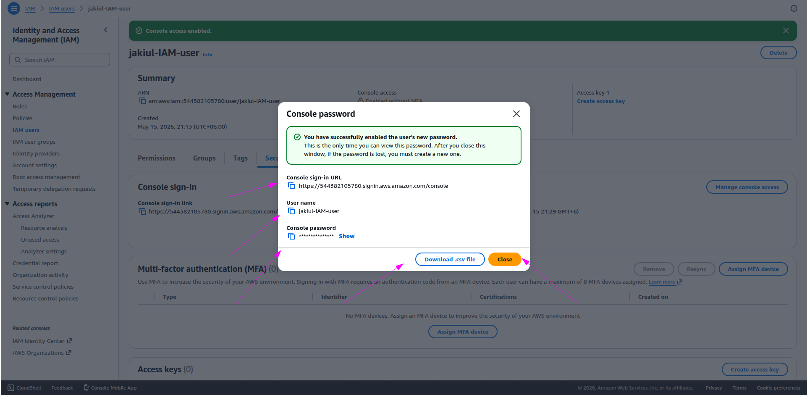

# ☁️ Step 1: IAM User Creation (AWS)

In this step, I created a new IAM user inside Identity and Access Management (IAM) service of AWS.

## 🔧 Work Description

I went to the IAM dashboard in :contentReference[oaicite:0]{index=0} and started creating a new user named `jakiul-IAM-user`.

During the process:
- I opened the **Users** section
- Clicked on **Create user**
- Entered the username: `jakiul-IAM-user`
- Proceeded to the next step

Then:
- I selected **Add user to group**
- Assigned the required permissions group
- Moved to the review section

After reviewing all configurations:
- I clicked on **Create user**
- The IAM user was successfully created

Next:
- I opened the created user
- Went to **Security credentials**
- Enabled **AWS Management Console access**
- Selected **Autogenerated password**
- Enabled option: *User must create a new password at next sign-in*

Finally:
- Console sign-in URL was generated
- Username and password were provided for login
- User setup was completed successfully

---

## 📸 Screenshots

