# ☁️ Step 1: IAM User Creation (AWS)

In this step, I created a new IAM user inside Identity and Access Management (IAM) service of AWS.

## 🔧 Work Description

I went to the IAM dashboard in :contentReference[oaicite:0]{index=0} and started creating a new user named `jakiul-IAM-user`.

During the process:
- I opened the **Users** section
- Clicked on **Create user**
- Entered the username: `jakiul-IAM-user`
- Proceeded to the next step

Then:
- I selected **Add user to group**
- Assigned the required permissions group
- Moved to the review section

After reviewing all configurations:
- I clicked on **Create user**
- The IAM user was successfully created

Next:
- I opened the created user
- Went to **Security credentials**
- Enabled **AWS Management Console access**
- Selected **Autogenerated password**
- Enabled option: *User must create a new password at next sign-in*

Finally:
- Console sign-in URL was generated
- Username and password were provided for login
- User setup was completed successfully

---

## 📸 Screenshots

 ---

# ☁️ Step 2: IAM User Login & S3 Permission Setup (AWS)

After creating the IAM user, I logged in using the **AWS Console Sign-in URL**, username, and password. During the first login, I reset the password and successfully entered the AWS Management Console.

## 🔐 Login Issue
After logging in, I noticed that the IAM user had **no permissions**, so I could not access AWS services like S3.

---

## 🛠️ Root Account Permission Setup

To fix this, I switched to the root account and went to the IAM policies section. From there, I created a new custom policy for S3 access and saved it.

Then I named the policy:  
**test-jakiul-allow-s3**

---

## 👤 Attach Policy to IAM User

After creating the policy:
- Went back to IAM User
- Clicked **Add permissions**
- Selected **Attach policies directly**
- Chose the newly created custom policy
- Clicked **Next → Add permissions**

Now the IAM user successfully got **S3 full access permission**.

---

## ❌ Permission Test
Later, I also tested removing the attached permission from the IAM user to understand how access control works in AWS IAM.

---

## 📸 Screenshots

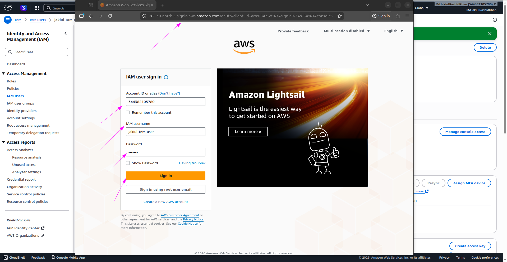  
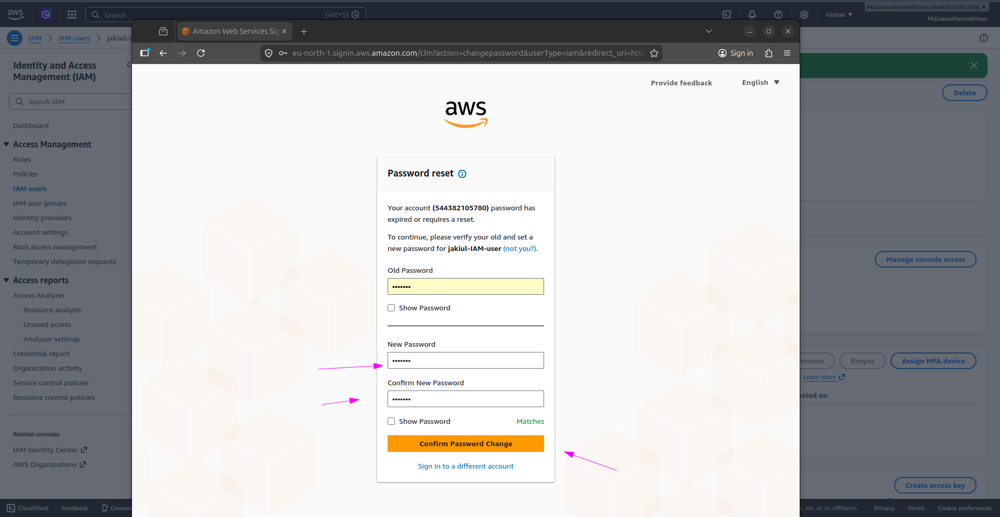  
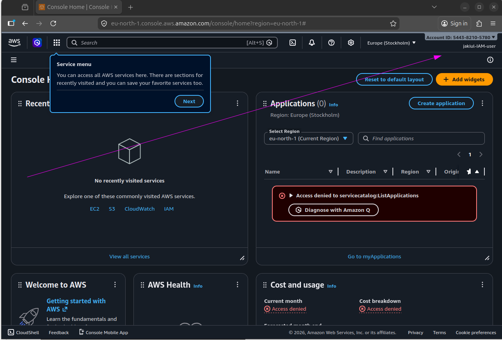  
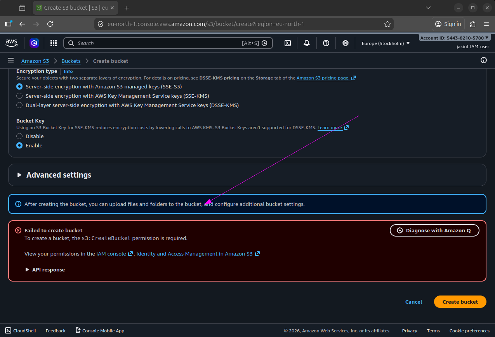  
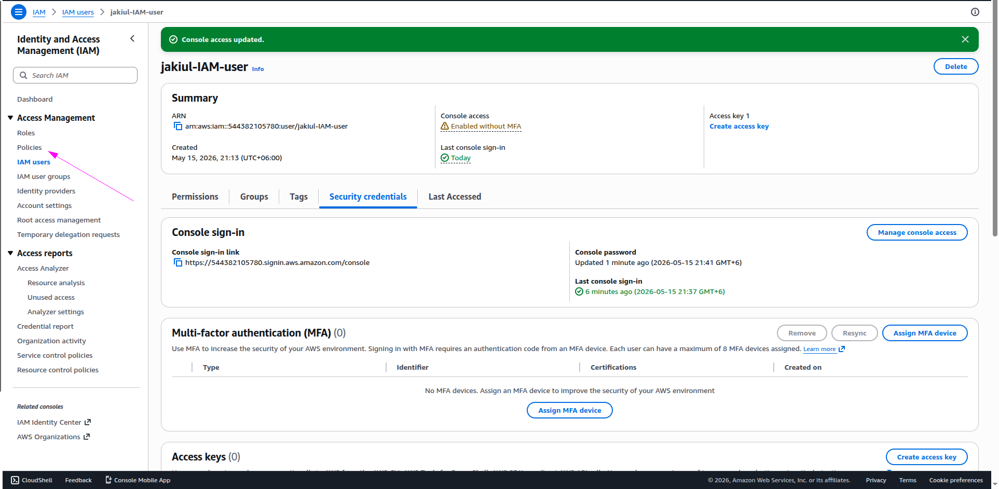  
  
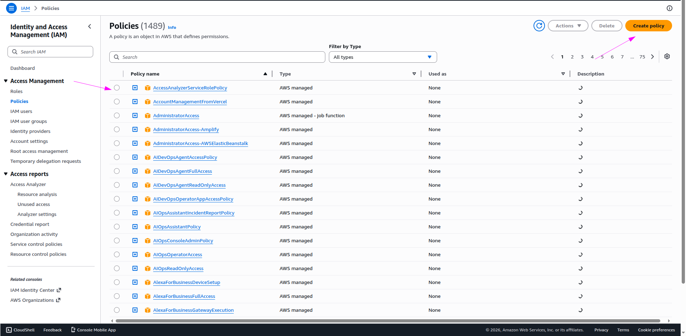  
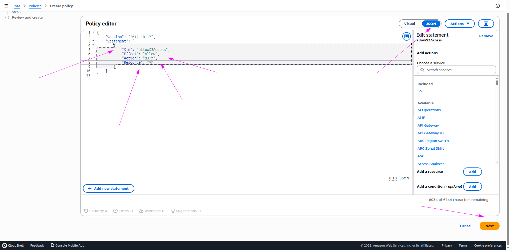  
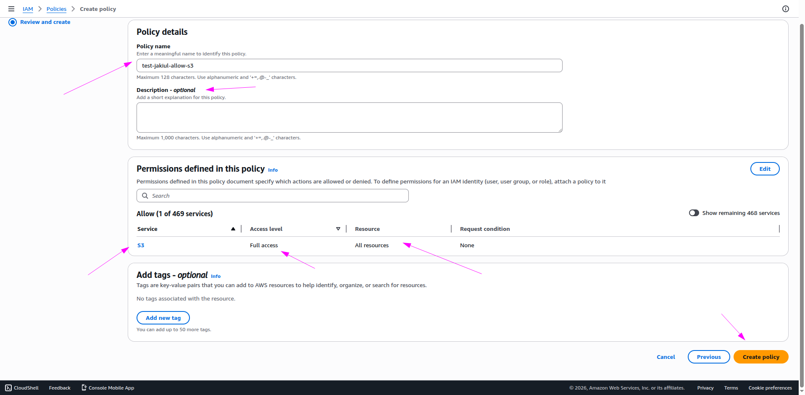  
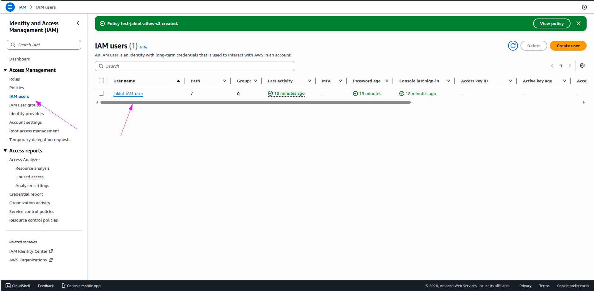  
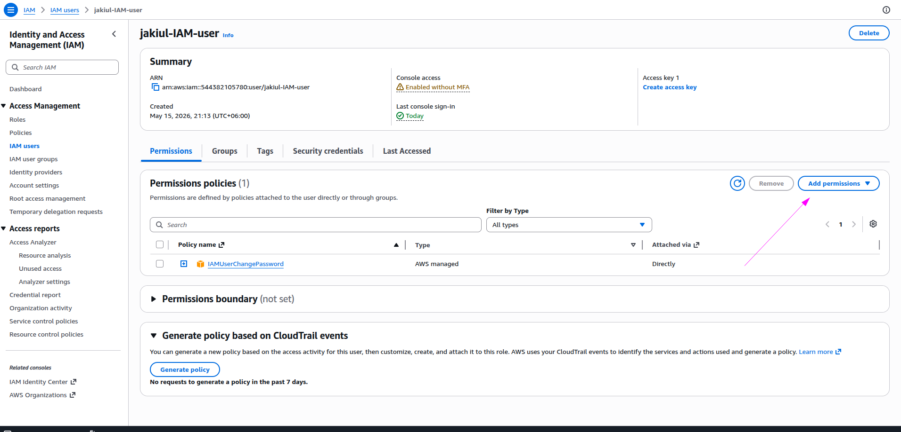  
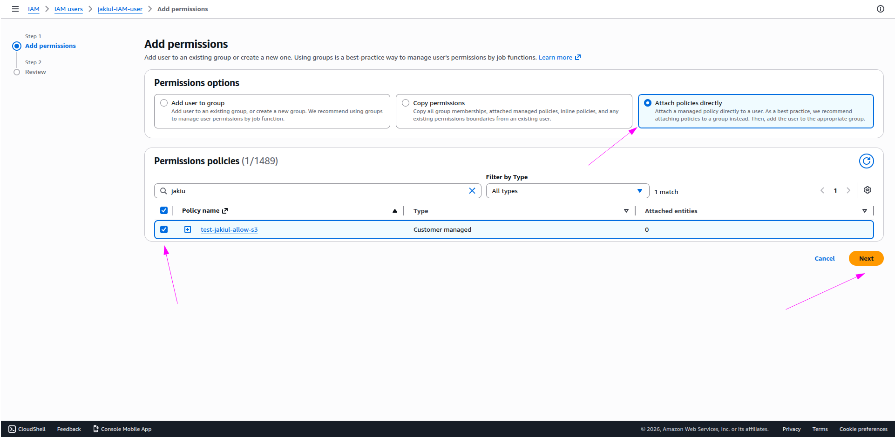  
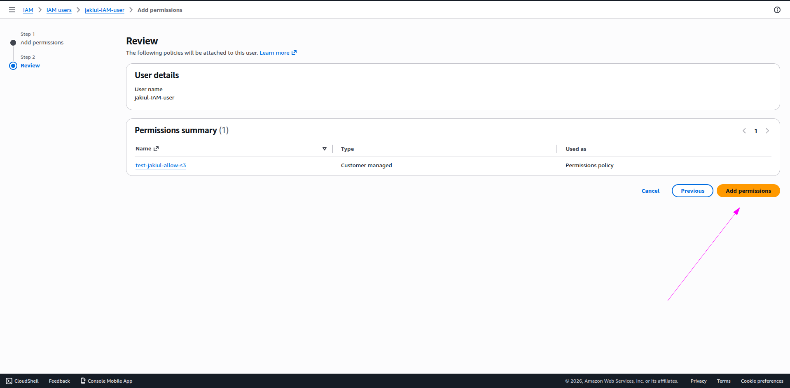  
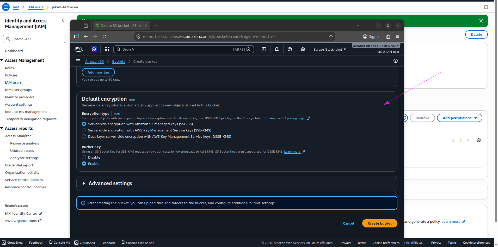  
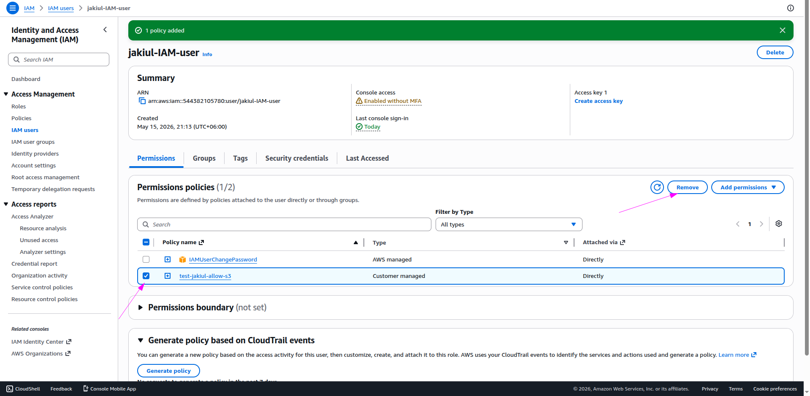

---
 

